# TÀI LIỆU ĐẶC TẢ YÊU CẦU PHẦN MỀM (SRS) - HỆ THỐNG PHÒNG KHÁM VÀ ĐẶT LỊCH KHÁM BỆNH (CLINIC 4.0)

Tài liệu này đặc tả chi tiết các yêu cầu nghiệp vụ, tác nhân, biểu đồ ca sử dụng (Use Case) tổng quát, phân rã và đặc tả các Use Case cốt lõi của hệ thống phòng khám và đặt lịch khám bệnh trực tuyến.

---

## 4.1 Đặc tả yêu cầu (Requirements Specification)

Hệ thống được thiết kế để kết nối Bệnh nhân, Bác sĩ chuyên khoa, Bác sĩ phòng ban/cận lâm sàng, Dược sĩ và Quản trị viên trong một quy trình khám chữa bệnh khép kín. Các yêu cầu phần mềm được chia làm hai loại: Yêu cầu chức năng và Yêu cầu phi chức năng.

### 4.1.1 Yêu cầu chức năng (Functional Requirements - FR)

#### Phân hệ 1: Quản lý tài khoản và phân quyền
*   **FR-1.1:** Đăng ký tài khoản: Hệ thống cho phép Bệnh nhân và Bác sĩ đăng ký tài khoản (hỗ trợ xác thực qua Google và đăng ký nội bộ).
*   **FR-1.2:** Đăng nhập và xác thực: Đăng nhập an toàn bằng Username và Mật khẩu. Phân quyền truy cập dựa trên vai trò (`role`: `patient`, `doctor`, `pharmacist`, `dept_doctor`).
*   **FR-1.3:** Quản lý thông tin cá nhân (Profile):
    *   Bệnh nhân: Cập nhật thông tin cơ bản, nhóm máu, tiền sử dị ứng, tình trạng bệnh lý.
    *   Bác sĩ: Cập nhật học vấn, kinh nghiệm làm việc, chuyên khoa, giá khám.
    *   Dược sĩ / Bác sĩ phòng ban: Cập nhật thông tin cá nhân.

#### Phân hệ 2: Quản lý đặt lịch khám (Booking)
*   **FR-2.1:** Tìm kiếm bác sĩ: Bệnh nhân tìm kiếm bác sĩ theo tên, chuyên khoa, địa điểm hoạt động.
*   **FR-2.2:** Quản lý lịch trống (Schedule): Bác sĩ thiết lập khung giờ làm việc theo từng ngày trong tuần. Hệ thống tự động chia nhỏ thời gian thành các slot khám (mặc định 15 phút/slot).
*   **FR-2.3:** Đặt lịch hẹn khám: Bệnh nhân chọn bác sĩ, chọn ngày và slot giờ còn trống để đặt lịch. Hệ thống kiểm tra ràng buộc để đảm bảo một bác sĩ không có hai lịch hẹn trùng giờ.
*   **FR-2.4:** Hủy lịch hẹn: Cho phép bệnh nhân hủy lịch khám trước giờ hẹn (theo quy tắc nghiệp vụ).

#### Phân hệ 3: Khám bệnh và chỉ định chuyên khoa (Clinical & Referral)
*   **FR-3.1:** Quản lý hàng đợi khám: Bác sĩ xem danh sách các cuộc hẹn hôm nay được sắp xếp theo thời gian.
*   **FR-3.2:** Khám bệnh ban đầu: Nhập thông tin triệu chứng và chẩn đoán ban đầu.
*   **FR-3.3:** Chỉ định chuyển khoa / cận lâm sàng (Referral): Bác sĩ có thể chỉ định bệnh nhân sang các phòng khoa cận lâm sàng (siêu âm, xét nghiệm, X-quang...) hoặc chuyên khoa khác để khám sâu hơn.
*   **FR-3.4:** Trả kết quả cận lâm sàng: Bác sĩ phòng ban nhận chỉ định, tiến hành khám cận lâm sàng, nhập kết quả và cập nhật trạng thái chỉ định thành hoàn thành.

#### Phân hệ 4: Kê đơn và Phát thuốc (Prescription & Pharmacy)
*   **FR-4.1:** Kê đơn thuốc: Bác sĩ kê đơn trực tiếp gắn liền với cuộc hẹn khám, nhập triệu chứng, chẩn đoán, và chọn các loại thuốc, liều dùng (sử dụng Rich Text Editor).
*   **FR-4.2:** Quản lý danh mục thuốc: Dược sĩ quản lý danh mục thuốc trong kho (Mã thuốc SKU, Tên thuốc, đơn vị, giá bán, số lượng tồn kho).
*   **FR-4.3:** Duyệt và phát thuốc: Dược sĩ tiếp nhận đơn thuốc từ hệ thống, chọn thuốc thực tế trong kho tương ứng đơn kê của bác sĩ, hệ thống tự động kiểm tra tồn kho, trừ kho, tính tiền và in hóa đơn phát thuốc.

#### Phân hệ 5: Đánh giá và Thống kê (Reviews & Statistics)
*   **FR-5.1:** Đánh giá bác sĩ: Bệnh nhân sau khi hoàn thành cuộc hẹn có quyền viết đánh giá và chấm điểm (1-5 sao) cho bác sĩ.
*   **FR-5.2:** Thống kê doanh thu và báo cáo:
    *   Bác sĩ: Xem biểu đồ thu nhập và số bệnh nhân đã khám.
    *   Admin: Thống kê tổng số lượng người dùng, doanh thu toàn phòng khám, số ca khám.

---

### 4.1.2 Yêu cầu phi chức năng (Non-functional Requirements - NFR)

*   **NFR-1 (Bảo mật - Security):** Tất cả các trang chức năng nhạy cảm phải được bảo vệ bởi lớp phân quyền (Role-based Access Control). Hệ thống phải chống lại các cuộc tấn công phổ biến như CSRF, SQL Injection, XSS bằng cơ chế của Django.
*   **NFR-2 (Hiệu năng - Performance):** Thời gian phản hồi trang web không quá 2 giây đối với các tác vụ thông thường. Sử dụng `select_related` và `prefetch_related` để tối ưu hóa truy vấn cơ sở dữ liệu.
*   **NFR-3 (Tính khả dụng - Usability):** Giao diện thiết kế đáp ứng (Responsive Design) tương thích tốt trên máy tính và thiết bị di động bằng Bootstrap. Giao diện dược sĩ và bác sĩ phải trực quan, hạn chế tối đa số lần click chuột.
*   **NFR-4 (Tính nhất quán dữ liệu - Consistency):** Quy trình phát thuốc và trừ kho phải nằm trong một Transaction duy nhất (sử dụng `transaction.atomic` và khóa `select_for_update`) để tránh tranh chấp dữ liệu khi nhiều dược sĩ phát thuốc đồng thời.

---

## 4.2 Tác nhân (Actors)

Hệ thống bao gồm 5 tác nhân chính tương tác với phần mềm:

| STT | Tác nhân (Actor) | Mô tả vai trò |
| :--- | :--- | :--- |
| 1 | **Bệnh nhân (Patient)** | Người dùng có nhu cầu tìm bác sĩ, đặt lịch khám, xem thông tin đơn thuốc của mình và đánh giá chất lượng dịch vụ của bác sĩ sau khi khám xong. |
| 2 | **Bác sĩ chuyên khoa (Doctor)** | Người khám bệnh chính, quản lý thời gian khám của mình, tiếp nhận bệnh nhân, thực hiện khám lâm sàng, đưa ra chỉ định cận lâm sàng (Referral) hoặc kê đơn thuốc trực tiếp cho bệnh nhân. |
| 3 | **Bác sĩ phòng ban (Department Doctor)** | Bác sĩ phụ trách các khoa cận lâm sàng (ví dụ: Khoa Xét nghiệm, Khoa Chẩn đoán hình ảnh). Họ tiếp nhận các chỉ định chuyển khoa từ bác sĩ chuyên khoa để thực hiện dịch vụ cận lâm sàng và cập nhật kết quả trả về hệ thống. |
| 4 | **Dược sĩ (Pharmacist)** | Người quản trị kho thuốc của phòng khám, tiếp nhận đơn thuốc đã khám xong của bệnh nhân từ hệ thống để chuẩn bị thuốc, kiểm kho, xác nhận phát thuốc và thu tiền thuốc. |
| 5 | **Quản trị viên (Administrator)** | Người có quyền cao nhất, quản trị danh mục hệ thống (Chuyên khoa, Phòng khoa, Người dùng), giám sát toàn bộ hoạt động đặt lịch, thanh toán, đơn thuốc và kiểm duyệt các đánh giá của bệnh nhân. |

---

## 4.3 Biểu đồ ca sử dụng và đặc tả (Use Case Diagrams)

> [!TIP]
> **Hướng dẫn vẽ sơ đồ:** Dưới đây là code định dạng **PlantUML** và **Mermaid**. Bạn có thể sao chép đoạn code PlantUML và dán vào trang [PlantText](https://www.planttext.com/) hoặc sử dụng extension PlantUML trong VS Code để tạo sơ đồ ảnh tự động. Code Mermaid có thể render trực tiếp trên các trình xem Markdown hỗ trợ Mermaid (như GitHub, Notion, Obsidian, Mermaid Live Editor).

### 4.3.1 Use case tổng quát (General Use Case)

Biểu đồ này hiển thị các tương tác cốt lõi của toàn bộ 5 tác nhân đối với hệ thống phòng khám.

#### Code PlantUML để vẽ biểu đồ tổng quát:
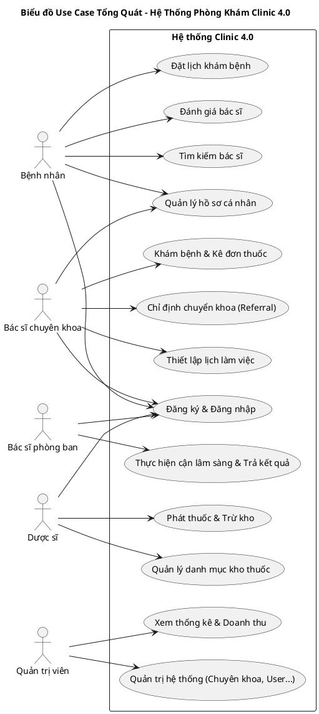

#### Code Mermaid để hiển thị trực tiếp trong Markdown:
```mermaid
graph TD
    %% Tác nhân
    Patient[Bệnh nhân]
    Doctor[Bác sĩ chuyên khoa]
    DeptDoctor[Bác sĩ phòng ban]
    Pharmacist[Dược sĩ]
    Admin[Quản trị viên]

    %% Hộp Hệ thống
    subgraph HeThongClinic [Hệ thống Clinic 4.0]
        UC_Auth(Đăng ký & Đăng nhập)
        UC_Profile(Quản lý hồ sơ cá nhân)
        UC_SearchDoc(Tìm kiếm bác sĩ)
        UC_Booking(Đặt lịch khám bệnh)
        UC_Review(Đánh giá bác sĩ)
        UC_Schedule(Thiết lập lịch làm việc)
        UC_Examine(Khám bệnh & Kê đơn thuốc)
        UC_Refer(Chỉ định chuyển khoa)
        UC_DeptExamine(Cận lâm sàng & Trả kết quả)
        UC_ManageMedicine(Quản lý kho thuốc)
        UC_Dispense(Phát thuốc & Trừ kho)
        UC_AdminSystem(Quản trị hệ thống)
        UC_Report(Thống kê & Doanh thu)
    end

    %% Kết nối
    Patient --> UC_Auth
    Patient --> UC_Profile
    Patient --> UC_SearchDoc
    Patient --> UC_Booking
    Patient --> UC_Review

    Doctor --> UC_Auth
    Doctor --> UC_Profile
    Doctor --> UC_Schedule
    Doctor --> UC_Examine
    Doctor --> UC_Refer

    DeptDoctor --> UC_Auth
    DeptDoctor --> UC_DeptExamine

    Pharmacist --> UC_Auth
    Pharmacist --> UC_ManageMedicine
    Pharmacist --> UC_Dispense

    Admin --> UC_AdminSystem
    Admin --> UC_Report
```

---

### 4.3.2 Phân rã use case (Use Case Decomposition)

Để mô tả chi tiết, chúng ta phân rã các Use Case thành các phân hệ nghiệp vụ cụ thể.

#### 1. Phân hệ Quản lý tài khoản & Đặt lịch (Tác nhân chính: Bệnh nhân, Bác sĩ)
Phân hệ này giải quyết việc bệnh nhân tìm kiếm bác sĩ, xem lịch trống và đặt hẹn.

##### Code PlantUML phân rã đặt lịch:
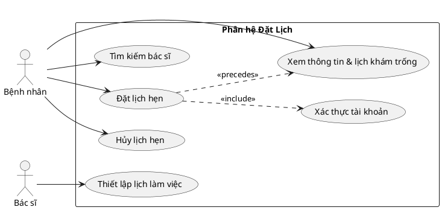

#### 2. Phân hệ Lâm sàng & Chỉ định cận lâm sàng (Tác nhân chính: Bác sĩ chuyên khoa, Bác sĩ phòng ban)
Phân hệ này giải quyết quy trình bác sĩ tiếp nhận khám bệnh, kê đơn và chuyển khoa làm cận lâm sàng.

##### Code PlantUML phân rã nghiệp vụ khám bệnh:
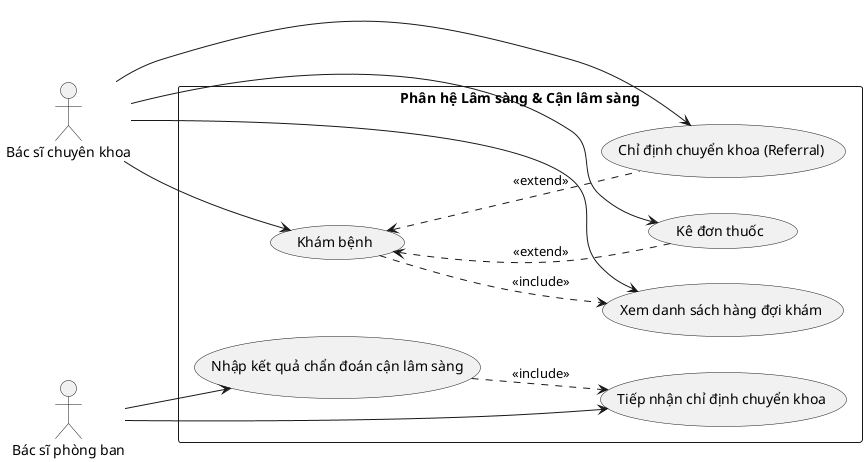

#### 3. Phân hệ Dược phẩm & Phát thuốc (Tác nhân chính: Dược sĩ)
Giải quyết quy trình tiếp nhận đơn thuốc, xuất kho và thu tiền.

##### Code PlantUML phân rã nghiệp vụ dược phẩm:
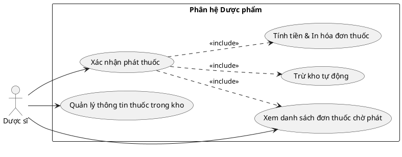

---

### 4.3.3 Đặc tả use case (Use Case Specification)

Dưới đây là bảng đặc tả chi tiết cho toàn bộ 12 Use Case chính của hệ thống phòng khám, bao gồm đầy đủ mô tả, tác nhân, tiền điều kiện, hậu điều kiện, luồng sự kiện chính và luồng ngoại lệ/thay thế.

---

#### UC-01: Đặt lịch khám bệnh (Tác nhân chính: Bệnh nhân)

| Mục | Nội dung đặc tả |
| :--- | :--- |
| **Mã Use Case** | UC-01 |
| **Tên Use Case** | Đặt lịch khám bệnh |
| **Tác nhân chính** | Bệnh nhân |
| **Tóm tắt mô tả** | Bệnh nhân chọn một bác sĩ, xem danh sách lịch khám còn trống của bác sĩ đó, chọn thời gian phù hợp và tiến hành đặt lịch hẹn khám bệnh. |
| **Tiền điều kiện** | Bệnh nhân đã đăng nhập vào hệ thống với tài khoản có vai trò là `patient`. |
| **Hậu điều kiện** | Một bản ghi [Booking](file:///d:/PBL3.PY/PBL3/bookings/models.py#L6) mới được tạo trong cơ sở dữ liệu với trạng thái mặc định là `pending`. Slot thời gian được chọn sẽ không còn khả dụng cho người khác đặt. |
| **Luồng sự kiện chính** | 1. Bệnh nhân truy cập trang danh sách bác sĩ.<br>2. Bệnh nhân tìm kiếm và chọn bác sĩ mong muốn, click "Xem lịch đặt hẹn".<br>3. Hệ thống truy vấn và hiển thị lịch khám trống (các ngày trong tuần và các slot giờ trống trong ngày đó).<br>4. Bệnh nhân chọn một ngày và một slot giờ cụ thể.<br>5. Bệnh nhân click xác nhận "Đặt lịch hẹn".<br>6. Hệ thống thực hiện kiểm tra ràng buộc thời gian (đảm bảo slot chưa bị ai khác nhanh tay đặt trước đó).<br>7. Hệ thống tạo mới đối tượng [Booking](file:///d:/PBL3.PY/PBL3/bookings/models.py#L6), lưu vào CSDL và gửi thông báo thành công cho Bệnh nhân.<br>8. Giao diện chuyển bệnh nhân về trang Lịch sử đặt hẹn. |
| **Luồng ngoại lệ / thay thế** | *   **Tại bước 6 (Trùng lịch khám):** Nếu slot giờ đó đã bị một bệnh nhân khác đặt thành công trước đó vài giây, hệ thống sẽ từ chối lưu, hiển thị thông báo lỗi "Slot thời gian này đã có người đặt, vui lòng chọn slot khác" và tải lại danh sách lịch trống của ngày đó. |

---

#### UC-02: Khám bệnh và Kê đơn thuốc (Tác nhân chính: Bác sĩ chuyên khoa)

| Mục | Nội dung đặc tả |
| :--- | :--- |
| **Mã Use Case** | UC-02 |
| **Tên Use Case** | Khám bệnh và Kê đơn thuốc |
| **Tác nhân chính** | Bác sĩ chuyên khoa |
| **Tóm tắt mô tả** | Bác sĩ tiếp nhận bệnh nhân đang chờ khám, tiến hành thăm khám lâm sàng, nhập triệu chứng, chẩn đoán bệnh và kê đơn thuốc trên hệ thống cho bệnh nhân. |
| **Tiền điều kiện** | Bác sĩ đã đăng nhập hệ thống với vai trò `doctor`. Bệnh nhân phải có lịch hẹn ở trạng thái `confirmed` hoặc `pending` trong ngày hôm nay. |
| **Hậu điều kiện** | Trạng thái cuộc hẹn [Booking](file:///d:/PBL3.PY/PBL3/bookings/models.py#L6) chuyển thành `completed`. Một bản ghi đơn thuốc [Prescription](file:///d:/PBL3.PY/PBL3/bookings/models.py#L45) được tạo mới và liên kết 1-1 với cuộc hẹn đó với trạng thái đơn thuốc ban đầu là `pending` (chờ phát thuốc). |
| **Luồng sự kiện chính** | 1. Bác sĩ mở trang "Dashboard bác sĩ", xem hàng đợi bệnh nhân chờ khám hôm nay.<br>2. Bác sĩ chọn bệnh nhân tiếp theo và chọn "Khám bệnh".<br>3. Bác sĩ thăm khám bệnh nhân, nhập dữ liệu vào ô "Triệu chứng" (Symptoms) và "Chẩn đoán" (Diagnosis).<br>4. Bác sĩ chọn các loại thuốc từ kho thuốc thông qua ô tìm kiếm, nhập số lượng và hướng dẫn sử dụng cho từng loại thuốc vào đơn thuốc.<br>5. Bác sĩ điền thêm ghi chú (nếu có) và click "Hoàn thành khám & Kê đơn".<br>6. Hệ thống kiểm tra hợp lệ dữ liệu đơn thuốc.<br>7. Hệ thống tạo mới đối tượng [Prescription](file:///d:/PBL3.PY/PBL3/bookings/models.py#L45), chuyển trạng thái [Booking](file:///d:/PBL3.PY/PBL3/bookings/models.py#L6) của bệnh nhân thành `completed`. Đơn thuốc được chuyển xuống hàng đợi của Dược sĩ.<br>8. Hệ thống thông báo thành công và đưa bác sĩ quay về Dashboard để khám bệnh nhân tiếp theo. |
| **Luồng ngoại lệ / thay thế** | *   **Chuyển khoa / cận lâm sàng:** Tại bước 3, nếu bác sĩ nhận thấy bệnh nhân cần làm xét nghiệm hoặc siêu âm trước khi kết luận chẩn đoán, bác sĩ chọn chức năng "Chỉ định chuyển khoa" (Referral), chọn khoa tương ứng (ví dụ: Khoa Xét nghiệm) và lý do chỉ định. Cuộc hẹn chuyển trạng thái sang dạng chờ kết quả cận lâm sàng. Bác sĩ tạm dừng khám ca này và quay lại khám sau khi có kết quả từ bác sĩ phòng ban. |

---

#### UC-03: Thực hiện phát thuốc và Trừ kho (Tác nhân chính: Dược sĩ)

| Mục | Nội dung đặc tả |
| :--- | :--- |
| **Mã Use Case** | UC-03 |
| **Tên Use Case** | Thực hiện phát thuốc và Trừ kho |
| **Tác nhân chính** | Dược sĩ |
| **Tóm tắt mô tả** | Dược sĩ tiếp nhận đơn thuốc đã khám xong, kiểm tra số lượng tồn kho của từng thuốc trong đơn, tiến hành trừ kho thuốc tự động, tính hóa đơn và xác nhận phát thuốc cho bệnh nhân. |
| **Tiền điều kiện** | Dược sĩ đăng nhập hệ thống với vai trò `pharmacist`. Có đơn thuốc [Prescription](file:///d:/PBL3.PY/PBL3/bookings/models.py#L45) của bệnh nhân đang ở trạng thái `pending` (chờ phát thuốc) do bác sĩ gửi xuống. |
| **Hậu điều kiện** | Trạng thái đơn thuốc [Prescription](file:///d:/PBL3.PY/PBL3/bookings/models.py#L45) chuyển thành `dispensed`. Một phiếu phát thuốc [PrescriptionDispensation](file:///d:/PBL3.PY/PBL3/pharmacy/models.py#L27) cùng các dòng chi tiết [PrescriptionDispensationItem](file:///d:/PBL3.PY/PBL3/pharmacy/models.py#L60) được tạo ra. Số lượng tồn kho (`quantity`) của các thuốc tương ứng trong bảng [Medicine](file:///d:/PBL3.PY/PBL3/pharmacy/models.py#L5) bị trừ đi tương ứng số lượng đã phát. |
| **Luồng sự kiện chính** | 1. Dược sĩ mở "Dashboard Dược sĩ", chọn danh sách "Đơn thuốc chờ phát".<br>2. Dược sĩ chọn đơn thuốc của bệnh nhân cần lấy thuốc, nhấn "Chuẩn bị phát".<br>3. Hệ thống hiển thị chi tiết các thuốc bác sĩ đã kê kèm theo số lượng tồn kho hiện tại của từng loại thuốc.<br>4. Dược sĩ kiểm đếm thuốc thực tế, kiểm tra hạn dùng, nhập ghi chú phát thuốc (nếu có) và nhấn "Xác nhận phát thuốc & Thanh toán".<br>5. Hệ thống khởi chạy một cơ chế giao dịch an toàn (Database Transaction) để thực hiện các bước sau:<br>&nbsp;&nbsp;&nbsp;&nbsp;a. Đọc và khóa dữ liệu các dòng thuốc trong kho để tránh tranh chấp số lượng.<br>&nbsp;&nbsp;&nbsp;&nbsp;b. Kiểm tra số lượng tồn kho xem còn đủ phát không.<br>&nbsp;&nbsp;&nbsp;&nbsp;c. Thực hiện trừ số lượng tồn kho tương ứng của từng loại thuốc.<br>&nbsp;&nbsp;&nbsp;&nbsp;d. Tạo phiếu phát thuốc và lưu đơn giá thuốc tại thời điểm phát để ghi nhận tài chính.<br>&nbsp;&nbsp;&nbsp;&nbsp;e. Đổi trạng thái đơn thuốc thành `dispensed` (đã phát thuốc).<br>6. Giao dịch thành công, hệ thống xuất hóa đơn chi tiết tiền thuốc và hiển thị thông báo phát thuốc thành công.<br>7. Dược sĩ tiến hành giao thuốc cho bệnh nhân và thu tiền. |
| **Luồng ngoại lệ / thay thế** | *   **Tại bước 5.b (Hết thuốc / Thiếu thuốc trong kho):** Nếu số lượng tồn kho của bất kỳ thuốc nào trong đơn nhỏ hơn số lượng cần phát, hệ thống tự động rollback toàn bộ giao dịch, không trừ kho của bất kỳ thuốc nào khác, đưa ra cảnh báo lỗi: "Thuốc [Tên thuốc] không đủ số lượng trong kho (Còn tồn: X, Cần phát: Y)" và giữ nguyên trạng thái đơn thuốc là chờ phát để dược sĩ cập nhật hoặc bổ sung kho. |

---

#### UC-04: Tìm kiếm bác sĩ (Tác nhân chính: Bệnh nhân)

| Mục | Nội dung đặc tả |
| :--- | :--- |
| **Mã Use Case** | UC-04 |
| **Tên Use Case** | Tìm kiếm bác sĩ |
| **Tác nhân chính** | Bệnh nhân |
| **Tóm tắt mô tả** | Bệnh nhân tìm kiếm bác sĩ theo từ khóa (tên), chuyên khoa hoặc theo tỉnh thành hoạt động để xem thông tin và chuẩn bị đặt lịch khám bệnh. |
| **Tiền điều kiện** | Không có (Bệnh nhân chưa đăng nhập hoặc đã đăng nhập đều dùng được). |
| **Hậu điều kiện** | Danh sách bác sĩ phù hợp với tiêu chí tìm kiếm được hiển thị cho bệnh nhân. |
| **Luồng sự kiện chính** | 1. Bệnh nhân truy cập trang danh sách bác sĩ.<br>2. Bệnh nhân nhập từ khóa tên bác sĩ vào ô tìm kiếm, hoặc chọn Chuyên khoa (Speciality), hoặc chọn Tỉnh thành.<br>3. Bệnh nhân nhấn nút "Tìm kiếm".<br>4. Hệ thống truy xuất dữ liệu từ bảng [Profile](file:///d:/PBL3.PY/PBL3/accounts/models.py#L134) (lọc theo các điều kiện người dùng nhập).<br>5. Hệ thống hiển thị danh sách kết quả bao gồm: hình ảnh, tên, chuyên khoa, số lượng đánh giá, điểm đánh giá trung bình và giá khám của mỗi bác sĩ. |
| **Luồng ngoại lệ / thay thế** | *   **Không tìm thấy kết quả:** Nếu không có bác sĩ nào thỏa mãn điều kiện tìm kiếm, hệ thống hiển thị thông báo "Không tìm thấy kết quả phù hợp" và hiển thị danh sách các bác sĩ nổi bật nhất hiện có. |

---

#### UC-05: Đăng ký & Đăng nhập tài khoản (Tác nhân chính: Tất cả tác nhân)

| Mục | Nội dung đặc tả |
| :--- | :--- |
| **Mã Use Case** | UC-05 |
| **Tên Use Case** | Đăng ký & Đăng nhập tài khoản |
| **Tác nhân chính** | Bệnh nhân, Bác sĩ, Dược sĩ, Bác sĩ phòng ban, Quản trị viên |
| **Tóm tắt mô tả** | Người dùng đăng ký tài khoản mới (đối với bệnh nhân/bác sĩ) và đăng nhập hệ thống để thực hiện các vai trò tương ứng. |
| **Tiền điều kiện** | Người dùng chưa đăng nhập hệ thống. |
| **Hậu điều kiện** | Một session làm việc được thiết lập cho người dùng, hệ thống điều hướng họ đến trang chức năng phù hợp với vai trò của mình. |
| **Luồng sự kiện chính** | 1. Người dùng chọn Đăng nhập hoặc Đăng ký trên trang chủ.<br>2. Nhập các thông tin đăng ký (Tên, username, email, mật khẩu, vai trò) hoặc thông tin đăng nhập (username và mật khẩu).<br>3. Người dùng xác nhận gửi thông tin.<br>4. Hệ thống kiểm tra dữ liệu trong bảng [User](file:///d:/PBL3.PY/PBL3/accounts/models.py#L14).<br>5. Nếu hợp lệ, hệ thống tạo session đăng nhập và điều hướng người dùng dựa vào vai trò `role`:<br>&nbsp;&nbsp;&nbsp;&nbsp;- `patient` -> Trang chủ tìm kiếm bác sĩ.<br>&nbsp;&nbsp;&nbsp;&nbsp;- `doctor` -> Dashboard Bác sĩ.<br>&nbsp;&nbsp;&nbsp;&nbsp;- `pharmacist` -> Dashboard Dược sĩ.<br>&nbsp;&nbsp;&nbsp;&nbsp;- `admin` -> Admin Dashboard. |
| **Luồng ngoại lệ / thay thế** | *   **Thông tin không chính xác:** Nếu username hoặc mật khẩu sai, hệ thống báo lỗi "Thông tin tài khoản hoặc mật khẩu không đúng" và giữ nguyên màn hình đăng nhập để nhập lại. |

---

#### UC-06: Thiết lập lịch làm việc (Tác nhân chính: Bác sĩ chuyên khoa)

| Mục | Nội dung đặc tả |
| :--- | :--- |
| **Mã Use Case** | UC-06 |
| **Tên Use Case** | Thiết lập lịch làm việc |
| **Tác nhân chính** | Bác sĩ chuyên khoa |
| **Tóm tắt mô tả** | Bác sĩ thiết lập các khung giờ khám bệnh (TimeRange) khả dụng theo từng ngày trong tuần (Thứ Hai đến Chủ Nhật). |
| **Tiền điều kiện** | Bác sĩ đã đăng nhập hệ thống với vai trò `doctor`. |
| **Hậu điều kiện** | Lịch làm việc được lưu thành công, các slot khám trống trong ngày được tạo ra để bệnh nhân có thể thấy và đặt hẹn. |
| **Luồng sự kiện chính** | 1. Bác sĩ truy cập trang "Quản lý lịch khám" (Schedule Timings).<br>2. Bác sĩ chọn một ngày trong tuần (ví dụ: Monday).<br>3. Bác sĩ thêm khung giờ làm việc mới (ví dụ: Giờ bắt đầu: 08:00, Giờ kết thúc: 11:30) và chọn số slot/giờ.<br>4. Bác sĩ click "Lưu lịch trình".<br>5. Hệ thống kiểm tra tính hợp lệ và ghi nhận các đối tượng [TimeRange](file:///d:/PBL3.PY/PBL3/PROJECT_DOCUMENTATION.md#L165) tương ứng cho ngày đó trong CSDL. |
| **Luồng ngoại lệ / thay thế** | *   **Trùng lặp khung giờ:** Nếu khung giờ mới trùng hoặc đè lên khung giờ cũ đã có của cùng ngày đó, hệ thống sẽ đưa ra cảnh báo lỗi và yêu cầu bác sĩ chỉnh sửa lại. |

---

#### UC-07: Chỉ định chuyển khoa / cận lâm sàng (Tác nhân chính: Bác sĩ chuyên khoa)

| Mục | Nội dung đặc tả |
| :--- | :--- |
| **Mã Use Case** | UC-07 |
| **Tên Use Case** | Chỉ định chuyển khoa / cận lâm sàng (Referral) |
| **Tác nhân chính** | Bác sĩ chuyên khoa |
| **Tóm tắt mô tả** | Bác sĩ chuyên khoa chỉ định bệnh nhân thực hiện thêm các khám chuyên sâu hoặc cận lâm sàng tại phòng khoa cận lâm sàng tương ứng trước khi đưa ra chẩn đoán cuối cùng. |
| **Tiền điều kiện** | Bác sĩ chuyên khoa đang trong quá trình khám bệnh (UC-02) cho bệnh nhân. |
| **Hậu điều kiện** | Bản ghi chỉ định [Referral](file:///d:/PBL3.PY/PBL3/bookings/models.py#L83) mới được tạo ở trạng thái `pending` chuyển đến khoa được chọn. Cuộc khám của bệnh nhân tạm thời chuyển sang trạng thái chờ kết quả. |
| **Luồng sự kiện chính** | 1. Tại màn hình khám bệnh, bác sĩ click nút "Chỉ định chuyển khoa".<br>2. Bác sĩ chọn khoa đích (ví dụ: Khoa Xét nghiệm, Khoa Siêu âm) và nhập lý do chỉ định.<br>3. Bác sĩ click "Xác nhận chỉ định".<br>4. Hệ thống kiểm tra dữ liệu, tạo mới bản ghi [Referral](file:///d:/PBL3.PY/PBL3/bookings/models.py#L83) liên kết với [Booking](file:///d:/PBL3.PY/PBL3/bookings/models.py#L6) hiện tại.<br>5. Hệ thống gửi thông tin chuyển tuyến lên hàng đợi công việc của khoa tương ứng. |
| **Luồng ngoại lệ / thay thế** | *   **Khoa ngừng hoạt động:** Nếu khoa phòng ban được chọn đang ở trạng thái ngưng hoạt động (`is_active=False`), hệ thống sẽ thông báo lỗi và yêu cầu bác sĩ chọn khoa khác. |

---

#### UC-08: Thực hiện dịch vụ cận lâm sàng & Trả kết quả (Tác nhân chính: Bác sĩ phòng ban)

| Mục | Nội dung đặc tả |
| :--- | :--- |
| **Mã Use Case** | UC-08 |
| **Tên Use Case** | Thực hiện dịch vụ cận lâm sàng & Trả kết quả |
| **Tác nhân chính** | Bác sĩ phòng ban (Department Doctor) |
| **Tóm tắt mô tả** | Bác sĩ phụ trách phòng cận lâm sàng tiếp nhận chỉ định, tiến hành các quy trình kỹ thuật y khoa và điền kết quả gửi về cho bác sĩ chuyên khoa. |
| **Tiền điều kiện** | Bác sĩ phòng ban đăng nhập hệ thống với vai trò `dept_doctor`. Có phiếu chỉ định [Referral](file:///d:/PBL3.PY/PBL3/bookings/models.py#L83) ở trạng thái `pending` hoặc `in_progress` gửi tới khoa của họ. |
| **Hậu điều kiện** | Bản ghi [Referral](file:///d:/PBL3.PY/PBL3/bookings/models.py#L83) được cập nhật trạng thái thành `completed` cùng nội dung kết quả văn bản và dữ liệu số hóa. Bác sĩ chuyên khoa nhận được thông báo kết quả. |
| **Lu## 4.4 Sơ đồ hoạt động (Activity Diagrams)

Nhằm làm rõ dòng xử lý nghiệp vụ của từng tính năng lớn trong hệ thống phòng khám, phần này cung cấp 4 sơ đồ hoạt động (Activity Diagram) tương ứng với 4 quy trình cốt lõi nhất dưới dạng phân làn (Swimlane) để làm rõ vai trò từng chủ thể.

### 4.4.1 Sơ đồ quy trình Đặt lịch khám (Booking Process)

Sơ đồ này mô tả chi tiết các bước và quyết định rẽ nhánh được phân làn rõ rệt giữa Bệnh nhân và Hệ thống trong quá trình đặt hẹn.

#### Code PlantUML vẽ Sơ đồ đặt lịch phân làn:
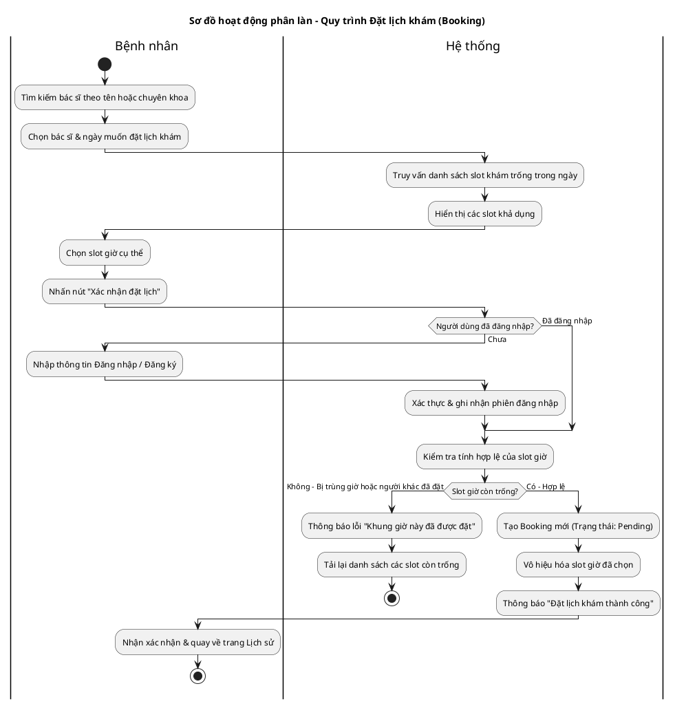

#### Code Mermaid vẽ Sơ đồ đặt lịch phân làn:
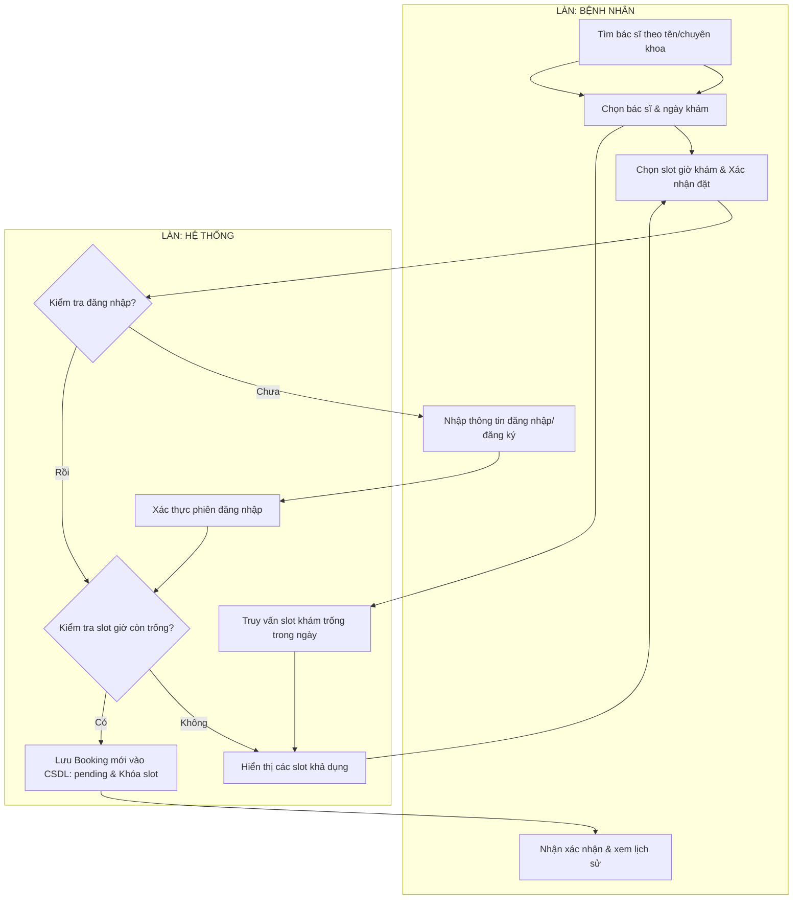

---

### 4.4.2 Sơ đồ quy trình Khám lâm sàng & Chỉ định cận lâm sàng (Clinical Examination & Referral)

Sơ đồ mô tả quy trình phối hợp khám bệnh lâm sàng của Bác sĩ chính, di chuyển của Bệnh nhân, và thực hiện cận lâm sàng của Bác sĩ phòng ban.

#### Code PlantUML vẽ Sơ đồ khám bệnh phân làn:
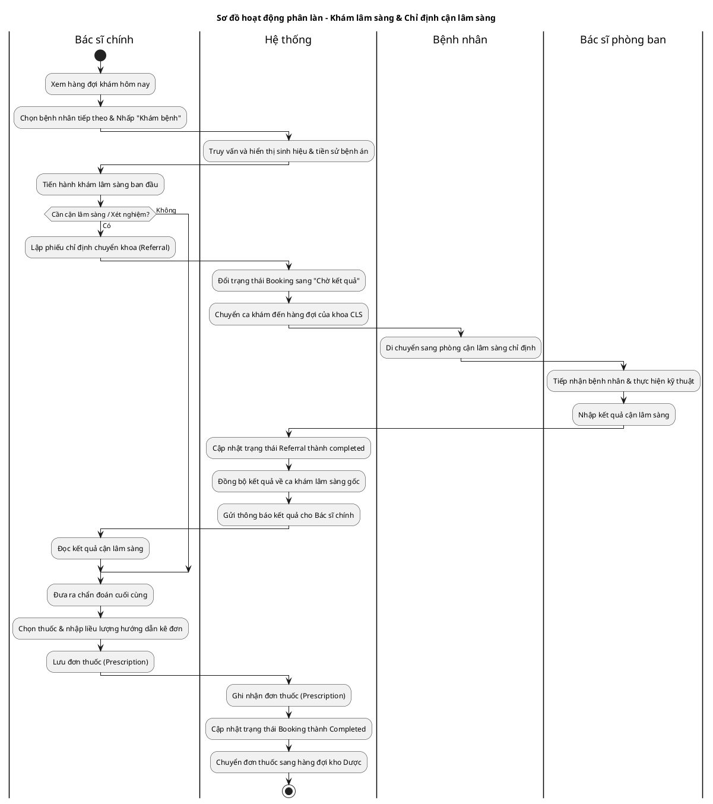

#### Code Mermaid vẽ Sơ đồ khám bệnh phân làn:
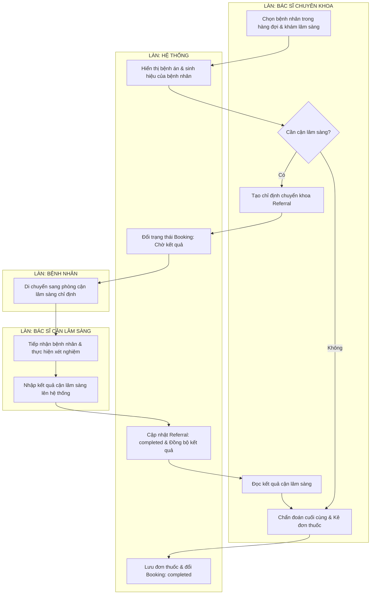

---

### 4.4.3 Sơ đồ quy trình Phát thuốc & Trừ kho (Dispensation & Stock Update)

Sơ đồ hoạt động mô tả chi tiết quy trình soạn thuốc của Dược sĩ và Transaction bảo mật của Hệ thống nhằm quản lý chính xác tồn kho thực tế.

#### Code PlantUML vẽ Sơ đồ phát thuốc phân làn:
```plantuml
@startuml
title Sơ đồ hoạt động phân làn - Quy trình Phát thuốc & Trừ kho
skinparam ConditionEndStyle hline

|Dược sĩ|
start
:Mở danh sách "Đơn thuốc chờ phát";
:Chọn đơn thuốc của bệnh nhân;

|Hệ thống|
:Truy vấn chi tiết đơn thuốc & tồn kho;
:Hiển thị chi tiết đơn kê kèm số lượng tồn kho thực tế;

|Dược sĩ|
:Soạn thuốc thực tế trong kho;
:Nhấn "Xác nhận phát thuốc & Thanh toán";

|Hệ thống|
:Bắt đầu Database Transaction;
:Khóa các dòng dữ liệu của thuốc (select_for_update);
if (Số lượng tồn kho đủ cấp phát?) then (Không đủ)
  :Rollback transaction;
  |Dược sĩ|
  :Hiển thị lỗi và hủy bỏ quy trình phát;
  stop
else (Đủ số lượng)
  |Hệ thống|
  :Trừ kho tồn của từng loại thuốc;
  :Tạo phiếu phát thuốc (PrescriptionDispensation);
  :Lưu đơn giá thực tế lúc phát;
  :Đổi trạng thái đơn thuốc sang 'dispensed';
  commit transaction;
  :Tính tiền thuốc & In hóa đơn;
  
  |Dược sĩ|
  :Thu tiền, in hóa đơn & giao thuốc cho bệnh nhân;
  
  |Bệnh nhân|
  :Nhận thuốc & thanh toán tiền;
  stop
endif
@endum
```

#### Code Mermaid vẽ Sơ đồ phát thuốc phân làn:
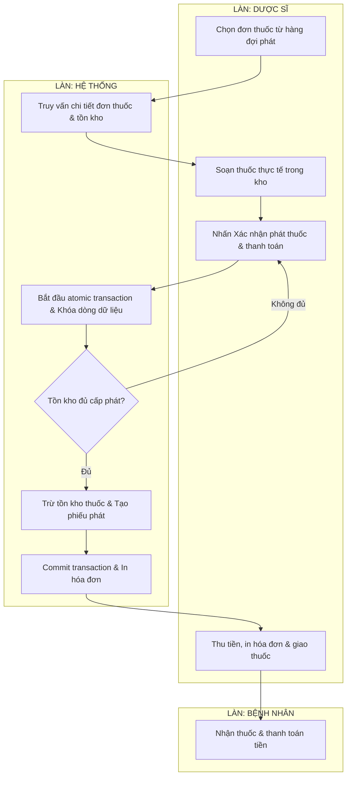

---

### 4.4.4 Sơ đồ quy trình Đăng ký & Đăng nhập (Auth & Redirect)

Sơ đồ mô tả quy trình Đăng ký, Đăng nhập và tự động phân làn chuyển hướng Dashboard theo vai trò.

#### Code PlantUML vẽ Sơ đồ xác thực phân làn:
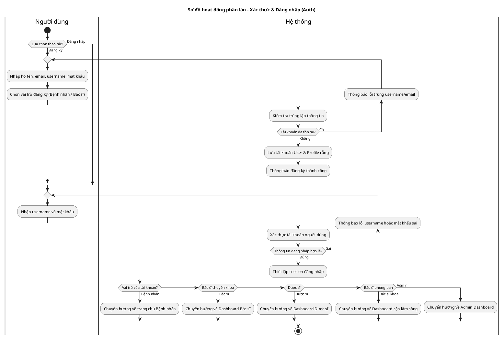

#### Code Mermaid vẽ Sơ đồ xác thực phân làn:
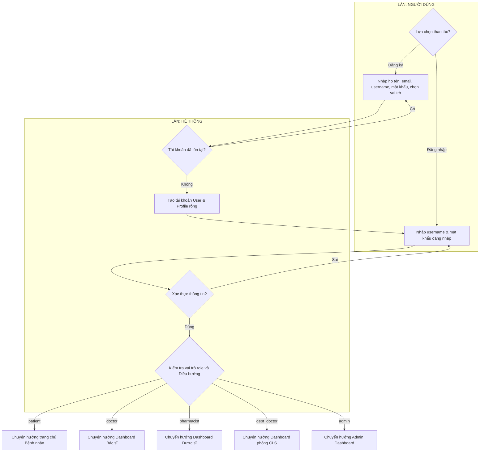

---

### 4.4.5 Sơ đồ hoạt động phân làn tổng thể (Swimlane Activity Diagram)

Để thể hiện rõ rệt sự tương tác và phân chia vai trò (phân làn / chia khung) giữa các tác nhân khác nhau (Bệnh nhân, Bác sĩ chuyên khoa, Bác sĩ phòng ban/cận lâm sàng, Dược sĩ) và Hệ thống, dưới đây là Sơ đồ hoạt động phân làn (Swimlane Activity Diagram) cho toàn bộ quy trình khám chữa bệnh tổng thể.

#### Code PlantUML vẽ Sơ đồ phân làn:
```plantuml
@startuml
title Sơ đồ hoạt động phân làn (Swimlane) - Quy trình khám chữa bệnh tổng thể
skinparam ConditionEndStyle hline

|Bệnh nhân|
start
:Tìm kiếm bác sĩ & chọn ngày khám;

|Hệ thống|
:Truy vấn slot khám trống;
:Hiển thị các slot khả dụng;

|Bệnh nhân|
:Chọn slot giờ khám & Xác nhận đặt;

|Hệ thống|
if (Kiểm tra slot trùng?) then (Trùng lịch)
  :Thông báo lỗi "Slot đã bị đặt";
  stop
else (Slot trống)
  :Tạo Booking (Trạng thái: Pending);
  :Vô hiệu hóa slot giờ đã chọn;
endif

|Bệnh nhân|
:Đến phòng khám theo lịch đặt;

|Bác sĩ chuyên khoa|
:Chọn bệnh nhân trong hàng đợi;
:Tiến hành khám lâm sàng ban đầu;
if (Cần khám cận lâm sàng / Xét nghiệm?) then (Có)
  :Lập phiếu chỉ định chuyển khoa (Referral);
  
  |Hệ thống|
  :Đổi trạng thái Booking sang "Chờ kết quả";
  :Đưa bệnh nhân vào hàng đợi của khoa CLS;
  
  |Bệnh nhân|
  :Di chuyển sang phòng cận lâm sàng;
  
  |Bác sĩ phòng ban|
  :Tiếp nhận bệnh nhân;
  :Thực hiện siêu âm / xét nghiệm...;
  :Nhập chẩn đoán cận lâm sàng lên hệ thống;
  
  |Hệ thống|
  :Cập nhật trạng thái Referral thành Completed;
  :Thông báo có kết quả cho bác sĩ chính;
  
  |Bác sĩ chuyên khoa|
  :Xem kết quả cận lâm sàng;
else (Không)
endif

:Chẩn đoán xác định bệnh & chọn thuốc kê đơn;
:Nhập hướng dẫn liều dùng & lưu đơn thuốc;

|Hệ thống|
:Tạo Prescription;
:Chuyển đơn thuốc xuống kho Dược;
:Cập nhật trạng thái Booking thành Completed;

|Dược sĩ|
:Chọn đơn thuốc trong hàng đợi chờ phát;
:Chuẩn bị thuốc thực tế theo đơn kê;
:Xác nhận phát thuốc & thanh toán;

|Hệ thống|
:Bắt đầu Database Transaction;
:Khóa dữ liệu tồn kho thuốc (select_for_update);
if (Tồn kho đủ thuốc?) then (Không đủ)
  :Rollback transaction;
  |Dược sĩ|
  :Hiển thị lỗi và tạm ngưng phát thuốc;
  stop
else (Đủ thuốc)
  |Hệ thống|
  :Trừ kho tồn của từng loại thuốc;
  :Tạo phiếu PrescriptionDispensation;
  :Cập nhật trạng thái Prescription thành Dispensed;
  commit transaction;
  :Tính tiền & in hóa đơn chi tiết;
endif

|Dược sĩ|
:Thu tiền từ bệnh nhân & giao thuốc;

|Bệnh nhân|
:Nhận thuốc;
:Viết đánh giá & xếp hạng bác sĩ (Tùy chọn);
stop
@endum
```

#### Code Mermaid vẽ Sơ đồ phân làn:
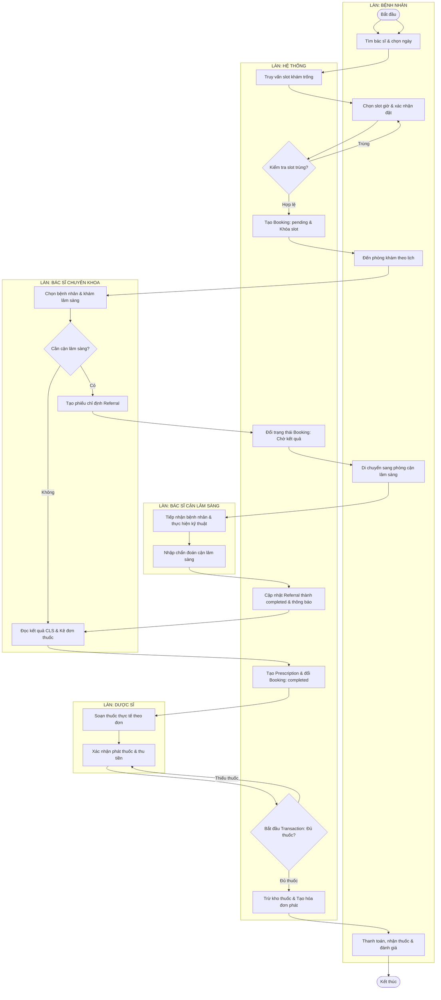

---

## 4.5 Các biểu đồ UML bổ sung (Additional UML Diagrams)-> Rollback[Hủy bỏ mọi thao tác Rollback]
        CheckStock -- Đủ thuốc --> DeductStock[Trừ tồn kho của từng loại thuốc]
        DeductStock --> CreateDispense[Tạo phiếu phát thuốc PrescriptionDispensation]
        CreateDispense --> RecordPrice[Lưu đơn giá thực tế lúc phát]
        RecordPrice --> UpdatePrescStatus[Cập nhật trạng thái đơn thuốc thành dispensed]
        UpdatePrescStatus --> CommitTrans[Xác nhận giao dịch Commit]
    end
    
    Rollback --> ErrorAlert[Thông báo lỗi thiếu thuốc & giữ nguyên đơn]
    ErrorAlert --> End_Fail([Kết thúc lỗi])
    
    CommitTrans --> PrintInvoice[In hóa đơn chi tiết tiền thuốc]
    PrintInvoice --> Handover[Dược sĩ giao thuốc, thu tiền]
    Handover --> End_Success([Kết thúc quy trình phát thuốc])
```

---

### 4.4.4 Sơ đồ quy trình Đăng ký & Đăng nhập (Authentication & Redirect)

Sơ đồ mô tả quy trình phân loại vai trò người dùng (Bệnh nhân, Bác sĩ, Dược sĩ, Admin) khi tham gia vào hệ thống.

#### Code PlantUML:
```plantuml
@startuml
title Sơ đồ hoạt động - Quy trình Đăng ký & Đăng nhập (Auth)
start
if (Người dùng muốn làm gì?) then (Đăng ký tài khoản)
  :Nhập họ tên, email, username, mật khẩu;
  :Chọn vai trò đăng ký (Bệnh nhân / Bác sĩ);
  if (Kiểm tra dữ liệu nhập?) then (Trùng username hoặc email)
    :Thông báo tài khoản đã tồn tại;
    stop
  else (Hợp lệ)
    :Lưu tài khoản User mới với vai trò tương ứng;
    :Tự động tạo bản ghi Profile rỗng;
  endif
else (Đăng nhập)
endif

:Nhập username và mật khẩu;
:Hệ thống xác thực tài khoản;
if (Thông tin đăng nhập đúng?) then (Sai)
  :Thông báo lỗi đăng nhập;
  stop
else (Đúng)
  :Thiết lập session đăng nhập cho người dùng;
  if (Vai trò của người dùng là gì?) then (Bệnh nhân - patient)
    :Chuyển hướng về trang chủ & Tìm kiếm bác sĩ;
  else (Bác sĩ - doctor)
    :Chuyển hướng về Dashboard Bác sĩ;
  else (Dược sĩ - pharmacist)
    :Chuyển hướng về Dashboard Dược sĩ;
  else (Bác sĩ phòng ban - dept_doctor)
    :Chuyển hướng về Dashboard phòng cận lâm sàng;
  else (Quản trị viên - admin)
    :Chuyển hướng về Admin Dashboard;
  endif
  stop
endif
@endum
```

#### Code Mermaid:
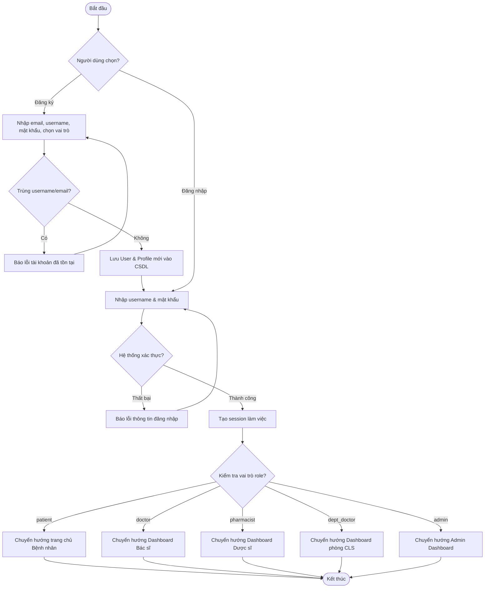

---

### 4.4.5 Sơ đồ hoạt động phân làn tổng thể (Swimlane Activity Diagram)

Để thể hiện rõ rệt sự tương tác và phân chia vai trò (phân làn / chia khung) giữa các tác nhân khác nhau (Bệnh nhân, Bác sĩ chuyên khoa, Bác sĩ phòng ban/cận lâm sàng, Dược sĩ) và Hệ thống, dưới đây là Sơ đồ hoạt động phân làn (Swimlane Activity Diagram) cho toàn bộ quy trình.

#### Code PlantUML vẽ Sơ đồ phân làn:
```plantuml
@startuml
title Sơ đồ hoạt động phân làn (Swimlane) - Quy trình khám chữa bệnh tổng thể
skinparam ConditionEndStyle hline

|Bệnh nhân|
start
:Tìm kiếm bác sĩ & chọn ngày khám;

|Hệ thống|
:Truy vấn slot khám trống;
:Hiển thị các slot khả dụng;

|Bệnh nhân|
:Chọn slot giờ khám & Xác nhận đặt;

|Hệ thống|
if (Kiểm tra slot trùng?) then (Trùng lịch)
  :Thông báo lỗi "Slot đã bị đặt";
  stop
else (Slot trống)
  :Tạo Booking (Trạng thái: Pending);
  :Vô hiệu hóa slot giờ đã chọn;
endif

|Bệnh nhân|
:Đến phòng khám theo lịch đặt;

|Bác sĩ chuyên khoa|
:Chọn bệnh nhân trong hàng đợi;
:Tiến hành khám lâm sàng ban đầu;
if (Cần khám cận lâm sàng / Xét nghiệm?) then (Có)
  :Lập phiếu chỉ định chuyển khoa (Referral);
  
  |Hệ thống|
  :Đổi trạng thái Booking sang "Chờ kết quả";
  :Đưa bệnh nhân vào hàng đợi của khoa CLS;
  
  |Bệnh nhân|
  :Di chuyển sang phòng cận lâm sàng;
  
  |Bác sĩ phòng ban|
  :Tiếp nhận bệnh nhân;
  :Thực hiện siêu âm / xét nghiệm...;
  :Nhập chẩn đoán cận lâm sàng lên hệ thống;
  
  |Hệ thống|
  :Cập nhật trạng thái Referral thành Completed;
  :Thông báo có kết quả cho bác sĩ chính;
  
  |Bác sĩ chuyên khoa|
  :Xem kết quả cận lâm sàng;
else (Không)
endif

:Chẩn đoán xác định bệnh & chọn thuốc kê đơn;
:Nhập hướng dẫn liều dùng & lưu đơn thuốc;

|Hệ thống|
:Tạo Prescription;
:Chuyển đơn thuốc xuống kho Dược;
:Cập nhật trạng thái Booking thành Completed;

|Dược sĩ|
:Chọn đơn thuốc trong hàng đợi chờ phát;
:Chuẩn bị thuốc thực tế theo đơn kê;
:Xác nhận phát thuốc & thanh toán;

|Hệ thống|
:Bắt đầu Database Transaction;
:Khóa dữ liệu tồn kho thuốc (select_for_update);
if (Tồn kho đủ thuốc?) then (Không đủ)
  :Rollback transaction;
  |Dược sĩ|
  :Hiển thị lỗi và tạm ngưng phát thuốc;
  stop
else (Đủ thuốc)
  |Hệ thống|
  :Trừ kho tồn của từng loại thuốc;
  :Tạo phiếu PrescriptionDispensation;
  :Cập nhật trạng thái Prescription thành Dispensed;
  commit transaction;
  :Tính tiền & in hóa đơn chi tiết;
endif

|Dược sĩ|
:Thu tiền từ bệnh nhân & giao thuốc;

|Bệnh nhân|
:Nhận thuốc;
:Viết đánh giá & xếp hạng bác sĩ (Tùy chọn);
stop
@endum
```

#### Code Mermaid vẽ Sơ đồ phân làn:


---

## 4.5 Các biểu đồ UML bổ sung (Additional UML Diagrams)

Nhằm làm tăng tính chuyên nghiệp và tính khả thi trong lập trình của tài liệu đặc tả hệ thống, phần này bổ sung thêm 5 sơ đồ thiết kế UML cốt lõi: Sơ đồ thực thể liên kết (ERD), 3 Sơ đồ tuần tự (Sequence Diagram) cho các quy trình nghiệp vụ xương sống, và Sơ đồ trạng thái cuộc hẹn (State Diagram).

### 4.5.1 Sơ đồ thực thể liên kết (Entity Relationship Diagram - ERD)

Sơ đồ này mô tả chi tiết cấu trúc các bảng cơ sở dữ liệu và các mối quan hệ (1-1, 1-N) giữa các Model trong code Django của bạn.

#### 📌 Mã PlantUML vẽ Sơ đồ ERD:
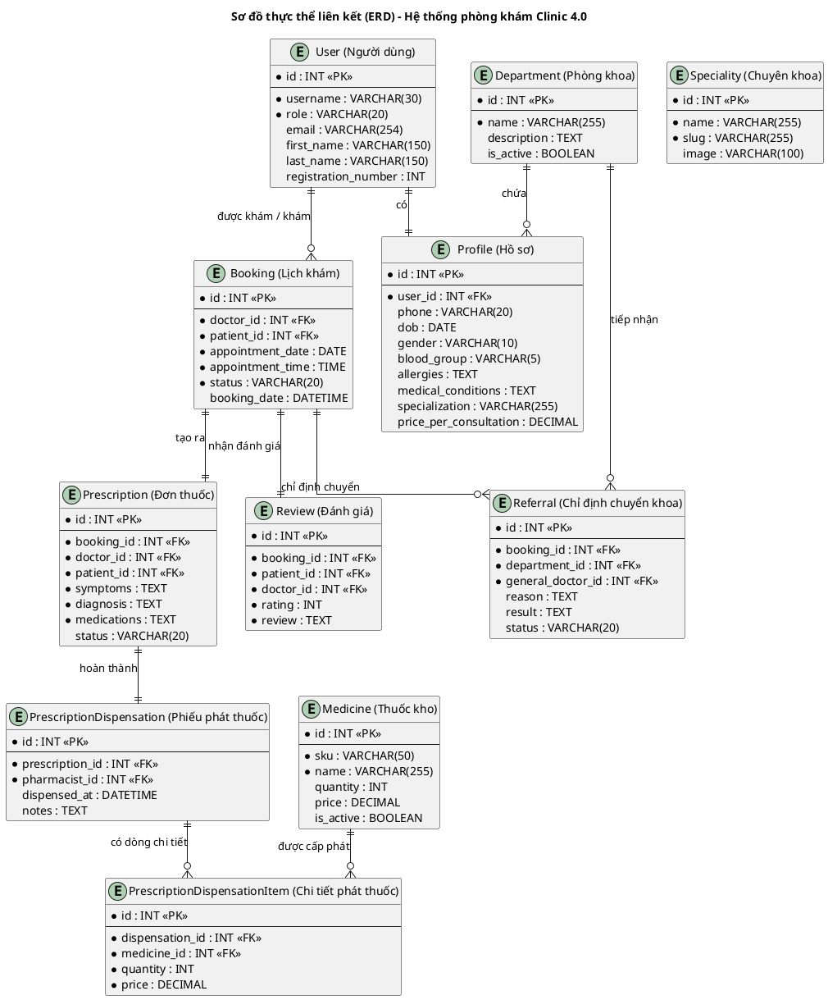

#### 📌 Mã Mermaid vẽ Sơ đồ ERD:
```mermaid
classDiagram
    class User {
        +int id
        +string username
        +string role
        +string email
        +string first_name
        +string last_name
        +int registration_number
    }
    class Profile {
        +int id
        +int user_id
        +string phone
        +date dob
        +string gender
        +string blood_group
        +string allergies
        +string medical_conditions
        +string specialization
        +decimal price_per_consultation
    }
    class Department {
        +int id
        +string name
        +string description
        +boolean is_active
    }
    class Booking {
        +int id
        +int doctor_id
        +int patient_id
        +date appointment_date
        +time appointment_time
        +string status
        +datetime booking_date
    }
    class Prescription {
        +int id
        +int booking_id
        +int doctor_id
        +int patient_id
        +string symptoms
        +string diagnosis
        +string medications
        +string status
    }
    class Referral {
        +int id
        +int booking_id
        +int department_id
        +int general_doctor_id
        +string reason
        +string result
        +string status
    }
    class Medicine {
        +int id
        +string sku
        +string name
        +int quantity
        +decimal price
        +boolean is_active
    }
    class PrescriptionDispensation {
        +int id
        +int prescription_id
        +int pharmacist_id
        +datetime dispensed_at
        +string notes
    }
    class PrescriptionDispensationItem {
        +int id
        +int dispensation_id
        +int medicine_id
        +int quantity
        +decimal price
    }
    class Review {
        +int id
        +int booking_id
        +int patient_id
        +int doctor_id
        +int rating
        +string review
    }

    User "1" -- "1" Profile : has
    Department "1" -- "0..*" Profile : contains
    User "1" -- "0..*" Booking : schedules
    Booking "1" -- "1" Prescription : has
    Booking "1" -- "1" Review : gets
    Booking "1" -- "0..*" Referral : refers
    Department "1" -- "0..*" Referral : receives
    Prescription "1" -- "1" PrescriptionDispensation : dispenses
    PrescriptionDispensation "1" -- "0..*" PrescriptionDispensationItem : has_items
    Medicine "1" -- "0..*" PrescriptionDispensationItem : fits
```

---

### 4.5.2 Sơ đồ tuần tự - Quy trình đặt lịch khám (Sequence Diagram - Booking Process)

Sơ đồ này mô tả sự tương tác qua lại giữa Bệnh nhân, giao diện, bộ xử lý View và Cơ sở dữ liệu SQLite trong quá trình đặt hẹn.

#### 📌 Mã PlantUML vẽ Sơ đồ Tuần tự đặt lịch:
```plantuml
@startuml
title Sơ đồ tuần tự - Quy trình đặt lịch khám (Sequence Diagram)
actor "Bệnh nhân" as Patient
boundary "Giao diện Đặt lịch" as UI
control "BookingView / Controller" as Ctrl
database "Cơ sở dữ liệu (SQLite3)" as DB

Patient -> UI : Chọn bác sĩ, ngày & giờ khám
UI -> Ctrl : Gửi request kiểm tra slot (doctor_id, date, time)
activate Ctrl
Ctrl -> DB : SELECT Booking WHERE doctor=doctor_id AND date=date AND time=time
activate DB
DB --> Ctrl : Kết quả truy vấn
deactivate DB

alt Slot đã bị trùng
  Ctrl --> UI : Trả về thông báo lỗi "Slot đã có người đặt"
  UI --> Patient : Hiển thị lỗi, yêu cầu chọn giờ khác
else Slot hợp lệ & còn trống
  Ctrl -> DB : INSERT INTO Booking (doctor, patient, date, time, status='pending')
  activate DB
  DB --> Ctrl : OK (Booking ID)
  deactivate DB
  Ctrl --> UI : Đặt lịch thành công!
  deactivate Ctrl
  UI --> Patient : Hiển thị xác nhận đặt lịch & Chuyển trang lịch sử
end
@endum
```

#### 📌 Mã Mermaid vẽ Sơ đồ Tuần tự đặt lịch:
```mermaid
sequenceDiagram
    actor Patient as Bệnh nhân
    participant UI as Giao diện Đặt lịch
    participant Ctrl as BookingView / Controller
    participant DB as Cơ sở dữ liệu (SQLite3)

    Patient->>UI: Chọn bác sĩ, ngày & giờ khám
    UI->>Ctrl: Gửi request kiểm tra slot (doctor_id, date, time)
    activate Ctrl
    Ctrl->>DB: Lấy lịch khám trùng của bác sĩ
    activate DB
    DB-->>Ctrl: Danh sách lịch hẹn
    deactivate DB

    alt Slot đã bị trùng
        Ctrl-->>UI: Trả về thông báo lỗi "Slot đã trùng"
        UI-->>Patient: Hiển thị lỗi, yêu cầu chọn slot khác
    else Slot còn trống
        Ctrl->>DB: INSERT INTO Booking (doctor, patient, date, time, status='pending')
        activate DB
        DB-->>Ctrl: OK (Booking ID)
        deactivate DB
        Ctrl-->>UI: Báo đặt lịch thành công!
        deactivate Ctrl
        UI-->>Patient: Hiển thị xác nhận thành công
    end
```

---

### 4.5.3 Sơ đồ tuần tự - Quy trình khám lâm sàng và Chỉ định cận lâm sàng (Sequence Diagram - Clinical Exam & Referral)

Mô tả luồng tương tác khi bác sĩ chính chỉ định xét nghiệm và bác sĩ phòng ban thực hiện kỹ thuật trả kết quả.

#### 📌 Mã PlantUML vẽ Sơ đồ Tuần tự khám lâm sàng:
```plantuml
@startuml
title Sơ đồ tuần tự - Quy trình khám & Chỉ định cận lâm sàng
actor "Bác sĩ chính" as Doctor
actor "Bác sĩ phòng ban" as DeptDoc
boundary "Giao diện Khám bệnh" as UI
control "ClinicalView / Controller" as Ctrl
database "Cơ sở dữ liệu (SQLite3)" as DB

Doctor -> UI : Tiếp nhận bệnh nhân & Nhấp "Khám bệnh"
UI -> Ctrl : Lấy bệnh án & chỉ số sinh hiệu
activate Ctrl
Ctrl -> DB : SELECT VitalSigns WHERE booking_id=id
activate DB
DB --> Ctrl : Dữ liệu sinh hiệu (BMI, Huyết áp...)
deactivate DB
Ctrl --> UI : Hiển thị giao diện khám
deactivate Ctrl

Doctor -> UI : Chọn "Chỉ định chuyển khoa" (Chọn khoa phòng ban, Lý do)
UI -> Ctrl : Gửi request tạo phiếu chỉ định (booking_id, department_id)
activate Ctrl
Ctrl -> DB : INSERT INTO Referral (booking, department, status='pending')
activate DB
DB --> Ctrl : OK (Referral ID)
deactivate DB
Ctrl --> UI : Tạo phiếu chỉ định thành công
deactivate Ctrl

Note over Patient, DeptDoc : Bệnh nhân di chuyển đến phòng cận lâm sàng

DeptDoc -> UI : Mở hàng đợi phòng ban & Nhập kết quả
UI -> Ctrl : Cập nhật kết quả cận lâm sàng (referral_id, result)
activate Ctrl
Ctrl -> DB : UPDATE Referral SET result=text, status='completed' WHERE id=referral_id
activate DB
DB --> Ctrl : OK
deactivate DB
Ctrl --> UI : Cập nhật thành công, đồng bộ kết quả
deactivate Ctrl

Doctor -> UI : Xem kết quả cận lâm sàng, đưa ra chẩn đoán & đơn thuốc
UI -> Ctrl : Gửi kết quả chẩn đoán và đơn thuốc
activate Ctrl
Ctrl -> DB : INSERT INTO Prescription (booking, doctor, patient, medications)
activate DB
DB --> Ctrl : OK
deactivate DB
Ctrl -> DB : UPDATE Booking SET status='completed' WHERE id=booking_id
activate DB
DB --> Ctrl : OK
deactivate DB
Ctrl --> UI : Hoàn thành ca khám & Kê đơn thuốc
deactivate Ctrl
@endum
```

#### 📌 Mã Mermaid vẽ Sơ đồ Tuần tự khám lâm sàng:
```mermaid
sequenceDiagram
    actor Doctor as Bác sĩ chính
    actor DeptDoc as Bác sĩ phòng ban
    participant UI as Giao diện Khám bệnh
    participant Ctrl as ClinicalView / Controller
    participant DB as Cơ sở dữ liệu (SQLite3)

    Doctor->>UI: Tiếp nhận bệnh nhân & nhấp "Khám bệnh"
    activate Ctrl
    Ctrl->>DB: Lấy thông tin sinh hiệu (VitalSigns)
    DB-->>Ctrl: Trả về BMI, chiều cao, cân nặng
    Ctrl-->>UI: Hiển thị giao diện nhập khám lâm sàng
    deactivate Ctrl

    Doctor->>UI: Tạo chỉ định chuyển khoa (Referral)
    activate Ctrl
    Ctrl->>DB: INSERT INTO Referral (status='pending')
    DB-->>Ctrl: OK (Referral ID)
    Ctrl-->>UI: Phiếu chỉ định thành công
    deactivate Ctrl

    Note over DeptDoc: Bệnh nhân đến khoa CLS thực hiện xét nghiệm
    DeptDoc->>UI: Tiếp nhận bệnh nhân & Nhập kết quả
    activate Ctrl
    Ctrl->>DB: UPDATE Referral SET result=text, status='completed'
    DB-->>Ctrl: OK
    Ctrl-->>UI: Cập nhật thành công
    deactivate Ctrl

    Doctor->>UI: Xem kết quả, kết luận chẩn đoán & kê đơn
    activate Ctrl
    Ctrl->>DB: INSERT INTO Prescription & UPDATE Booking SET status='completed'
    DB-->>Ctrl: OK
    Ctrl-->>UI: Báo hoàn tất khám bệnh
    deactivate Ctrl
```

---

### 4.5.4 Sơ đồ tuần tự - Quy trình phát thuốc và Trừ kho (Sequence Diagram - Dispensation & Inventory Update)

Mô tả cơ chế Transaction bảo vệ tính toàn vẹn dữ liệu tồn kho khi phát thuốc.

#### 📌 Mã PlantUML vẽ Sơ đồ Tuần tự phát thuốc:
```plantuml
@startuml
title Sơ đồ tuần tự - Quy trình phát thuốc & Cập nhật kho
actor "Dược sĩ" as Pharmacist
boundary "Giao diện Phát thuốc" as UI
control "PharmacyView / Controller" as Ctrl
database "Cơ sở dữ liệu (SQLite3)" as DB

Pharmacist -> UI : Chọn đơn thuốc cần phát & Nhấp "Chuẩn bị phát"
UI -> Ctrl : Lấy chi tiết đơn thuốc (prescription_id)
activate Ctrl
Ctrl -> DB : SELECT * FROM Prescription WHERE id=prescription_id
activate DB
DB --> Ctrl : Dữ liệu đơn thuốc
deactivate DB
Ctrl --> UI : Hiển thị chi tiết đơn thuốc & Tồn kho thực tế
deactivate Ctrl

Pharmacist -> UI : Nhấp "Xác nhận phát thuốc & Thanh toán"
UI -> Ctrl : Gửi yêu cầu phát thuốc (prescription_id, items)
activate Ctrl
Note over Ctrl : Khởi tạo Transaction (transaction.atomic())

Ctrl -> DB : SELECT quantity FROM Medicine WHERE id=med_id FOR UPDATE (Khóa dữ liệu)
activate DB
DB --> Ctrl : Số lượng tồn kho hiện tại
deactivate DB

alt Không đủ số lượng tồn kho
  Ctrl --> UI : Rollback Transaction & Trả lỗi "Không đủ thuốc"
  UI --> Pharmacist : Cảnh báo thiếu thuốc trong kho
else Đủ số lượng tồn kho
  Ctrl -> DB : UPDATE Medicine SET quantity = quantity - sold_qty WHERE id=med_id
  activate DB
  DB --> Ctrl : OK
  deactivate DB
  
  Ctrl -> DB : INSERT INTO PrescriptionDispensation (prescription, pharmacist, total_cost)
  activate DB
  DB --> Ctrl : OK (Dispensation ID)
  deactivate DB
  
  Ctrl -> DB : UPDATE Prescription SET status='dispensed' WHERE id=prescription_id
  activate DB
  DB --> Ctrl : OK
  deactivate DB
  
  Note over Ctrl : Commit Transaction thành công
  Ctrl --> UI : Trả về hóa đơn chi tiết thuốc phát
  deactivate Ctrl
  UI --> Pharmacist : Hiển thị hóa đơn thành công, In hóa đơn & Giao thuốc
end
@endum
```

#### 📌 Mã Mermaid vẽ Sơ đồ Tuần tự phát thuốc:
```mermaid
sequenceDiagram
    actor Pharmacist as Dược sĩ
    participant UI as Giao diện Phát thuốc
    participant Ctrl as PharmacyView / Controller
    participant DB as Cơ sở dữ liệu (SQLite3)

    Pharmacist->>UI: Chọn đơn thuốc chờ phát & Nhấp "Chuẩn bị"
    activate Ctrl
    Ctrl->>DB: SELECT * FROM Prescription
    DB-->>Ctrl: Đơn thuốc & Số lượng thuốc
    Ctrl-->>UI: Hiển thị giao diện xuất thuốc
    deactivate Ctrl

    Pharmacist->>UI: Xác nhận phát thuốc & Thanh toán
    activate Ctrl
    Note over Ctrl: Bắt đầu Transaction (atomic)
    Ctrl->>DB: Lấy số lượng thuốc (FOR UPDATE khóa hàng)
    DB-->>Ctrl: Tồn kho hiện tại
    
    alt Hết thuốc
        Note over Ctrl: Rollback Transaction
        Ctrl-->>UI: Thông báo lỗi hết thuốc
        UI-->>Pharmacist: Hiển thị cảnh báo
    else Đủ thuốc
        Ctrl->>DB: Giảm số lượng tồn kho (UPDATE Medicine)
        DB-->>Ctrl: OK
        Ctrl->>DB: Tạo phiếu phát thuốc (INSERT Dispensation)
        DB-->>Ctrl: OK
        Ctrl->>DB: Cập nhật đơn thuốc thành 'dispensed'
        DB-->>Ctrl: OK
        Note over Ctrl: Commit Transaction
        Ctrl-->>UI: Trả về phiếu tính tiền & hóa đơn
        deactivate Ctrl
        UI-->>Pharmacist: Cho phép In hóa đơn & giao thuốc
    end
```

---

### 4.5.5 Sơ đồ trạng thái cuộc khám (State Machine Diagram - Booking Status Lifecycle)

Sơ đồ này mô tả vòng đời chuyển đổi trạng thái của thực thể Booking (Lịch khám) trong cơ sở dữ liệu.

#### 📌 Mã PlantUML vẽ Sơ đồ Trạng thái:
```plantuml
@startuml
title Sơ đồ trạng thái - Vòng đời của Lịch khám (Booking Status Lifecycle)
[*] --> Pending : Khởi tạo lịch hẹn khám

Pending --> Confirmed : Admin hoặc Bác sĩ xác nhận lịch hẹn
Pending --> Cancelled : Bệnh nhân hủy lịch khám
Confirmed --> Cancelled : Bệnh nhân hủy lịch khám trước giờ hẹn

Confirmed --> Completed : Bác sĩ khám lâm sàng xong & kê đơn thành công
Confirmed --> NoShow : Bệnh nhân không đến khám đúng giờ hẹn

Completed --> [*]
Cancelled --> [*]
NoShow --> [*]
@endum
```

#### 📌 Mã Mermaid vẽ Sơ đồ Trạng thái:
```mermaid
stateDiagram-v2
    [*] --> Pending : Khởi tạo cuộc hẹn đặt lịch
    
    Pending --> Confirmed : Xác nhận cuộc hẹn (Bác sĩ/Admin)
    Pending --> Cancelled : Bệnh nhân tự hủy cuộc hẹn
    
    Confirmed --> Cancelled : Hủy hẹn trước giờ khám
    Confirmed --> NoShow : Quá giờ hẹn nhưng bệnh nhân không đến khám
    Confirmed --> Completed : Bác sĩ khám xong & Kê đơn thuốc thành công
    
    Completed --> [*]
    Cancelled --> [*]
    NoShow --> [*]
```

---
Tài liệu này được biên soạn bởi Chuyên gia phân tích hệ thống (SRS Expert) để phục vụ cho sự phát triển chuẩn mực của dự án PBL3.

