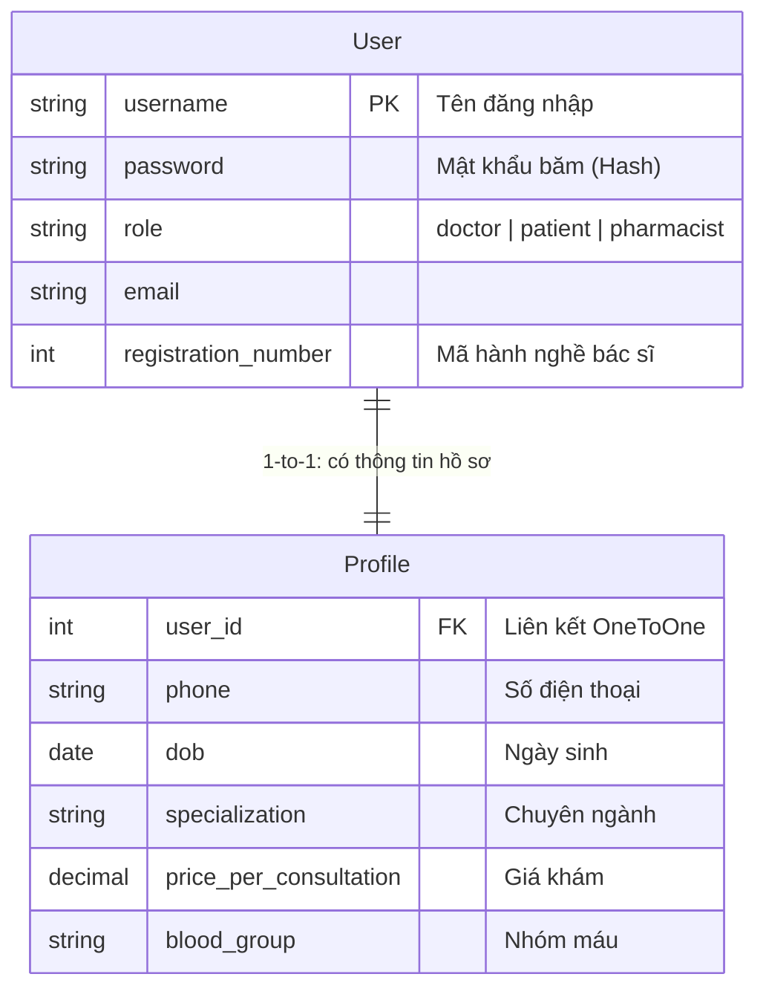

# Hướng Dẫn Kỹ Thuật: Nền Tảng Hệ Thống & Quản Lý Người Dùng (Core & Accounts)

Tài liệu này được biên soạn dành cho thành viên chịu trách nhiệm về **Nền tảng hệ thống & Quản lý người dùng (Core & Accounts)**. Tài liệu giúp bạn nắm vững kiến trúc "bộ khung" của dự án PBL3, hiểu sâu sắc về luồng xác thực (Authentication) - phân quyền (Authorization), và cách xây dựng giao diện kế thừa (Template Inheritance).

---

## 1. Bản Đồ Thư Mục & Module Phụ Trách

Bạn sẽ làm việc trực tiếp và quản lý các thư mục/file sau đây:
* [doccure/](file:///d:/PBL3.PY/PBL3/doccure/): Chứa cấu hình trung tâm dự án.
  * [settings.py](file:///d:/PBL3.PY/PBL3/doccure/settings.py): Thiết lập Database, Installed Apps, Middleware, Static/Media.
  * [urls.py](file:///d:/PBL3.PY/PBL3/doccure/urls.py): Định tuyến chính cấp dự án.
* [accounts/](file:///d:/PBL3.PY/PBL3/accounts/): Module quản lý tài khoản người dùng.
  * [models.py](file:///d:/PBL3.PY/PBL3/accounts/models.py): Khai báo Custom User và Profile.
  * [forms.py](file:///d:/PBL3.PY/PBL3/accounts/forms.py): Form đăng ký, đăng nhập và thông tin.
  * [views/](file:///d:/PBL3.PY/PBL3/accounts/views/): Logic xử lý nghiệp vụ đăng nhập, đăng ký, đăng xuất.
* [mixins/](file:///d:/PBL3.PY/PBL3/mixins/): Các lớp Mixin kiểm tra quyền truy cập cho Class-based view.
  * [custom_mixins.py](file:///d:/PBL3.PY/PBL3/mixins/custom_mixins.py): `DoctorRequiredMixin`, `PatientRequiredMixin`, `PharmacistRequiredMixin`.
* [core/](file:///d:/PBL3.PY/PBL3/core/): Chứa các thành phần dùng chung toàn cục.
  * [decorators.py](file:///d:/PBL3.PY/PBL3/core/decorators.py): Decorator phân quyền cho Function-based view.
  * [models.py](file:///d:/PBL3.PY/PBL3/core/models.py): Bảng Chuyên khoa (`Speciality`) và Đánh giá (`Review`).
  * [templatetags/currency_filters.py](file:///d:/PBL3.PY/PBL3/core/templatetags/currency_filters.py): Filter chuyển đổi giá tiền sang định dạng VNĐ.
* [templates/](file:///d:/PBL3.PY/PBL3/templates/): Thư mục giao diện HTML.
  * [base.html](file:///d:/PBL3.PY/PBL3/templates/base.html): Khung giao diện cơ sở chứa CSS/JS dùng chung.
  * [includes/](file:///d:/PBL3.PY/PBL3/templates/includes/): Thanh điều hướng (`navbar.html`), chân trang (`footer.html`) và các sidebar động (`doctor-sidebar.html`, `patient-sidebar.html`, `pharmacist-sidebar.html`).

---

## 2. Kiến Trúc Bộ Khung Dự Án (System Platform Settings)

### Cấu hình `settings.py` (Trọng tâm hệ thống)
File: [doccure/settings.py](file:///d:/PBL3.PY/PBL3/doccure/settings.py)
* **`INSTALLED_APPS`**: Đăng ký các app nghiệp vụ tự phát triển và thư viện bên thứ ba.
  * Các app tự viết: `core`, `accounts`, `doctors`, `patients`, `bookings`, `pharmacy`.
  * Thư viện ngoài: `ckeditor` (trình soạn thảo đơn thuốc), `debug_toolbar` (phân tích hiệu năng).
* **Ghi đè User Model (`AUTH_USER_MODEL`)**:
  * Dòng lệnh `AUTH_USER_MODEL = 'accounts.User'` thông báo cho Django biết rằng ta không dùng bảng User mặc định của framework mà sử dụng Custom User đã được định nghĩa tại app `accounts`.
* **Cấu hình Static & Media**:
  * **Static**: Chứa tài nguyên tĩnh cố định (CSS, JS, hình ảnh mặc định của giao diện) đặt tại [static/](file:///d:/PBL3.PY/PBL3/static/).
  * **Media**: Lưu trữ tài nguyên động do người dùng upload lên (ảnh đại diện, ảnh chuyên khoa) nằm tại [media/](file:///d:/PBL3.PY/PBL3/media/).

### Cấu hình `urls.py` (Cơ chế định tuyến phân tán)
File: [doccure/urls.py](file:///d:/PBL3.PY/PBL3/doccure/urls.py)
* Dự án áp dụng nguyên tắc **Low Coupling** (giảm liên kết) bằng cách phân tán URLs. File URL tổng chỉ khai báo tiền tố đường dẫn và `include` các file URL con của từng app:
  ```python
  urlpatterns = [
      path('admin/', admin.site.urls),
      path('', include('core.urls')),
      path('accounts/', include('accounts.urls')),
      path('doctors/', include('doctors.urls')),
      # ...
  ]
  ```

---

## 3. Xác Thực (Authentication) & Quản Lý Người Dùng

Để hệ thống vận hành, thông tin người dùng được quản lý qua mô hình hai lớp chính tại [accounts/models.py](file:///d:/PBL3.PY/PBL3/accounts/models.py):



### Lớp 1: Bảng Đăng Nhập (`accounts_user`)
Model `User` kế thừa từ `AbstractUser` giúp thừa hưởng toàn bộ cơ chế đăng nhập và mã hóa mật khẩu cực kỳ bảo mật của Django.
* Điểm đặc trưng là trường `role` phân chia vai trò người dùng thành:
  * `doctor`: Bác sĩ.
  * `patient`: Bệnh nhân.
  * `pharmacist`: Dược sĩ.
* Trường `registration_number` dành riêng cho Bác sĩ để lưu mã số hành nghề y tế.

### Lớp 2: Bảng Thông Tin Chi Tiết (`accounts_profile`)
Model `Profile` có mối quan hệ **OneToOneField** với `User`.
* Khi tạo tài khoản mới, một Profile trống sẽ được tạo liên kết. 
* Profile lưu trữ các thông tin chi tiết không phục vụ trực tiếp cho quá trình đăng nhập nhưng cần thiết cho nghiệp vụ khám bệnh (ngày sinh, giới tính, địa chỉ, nhóm máu, tiền sử dị ứng, giá tiền khám của bác sĩ...).

---

## 4. Phân Quyền Hệ Thống (Authorization Flow)

Làm thế nào hệ thống biết ai đang truy cập và có quyền vào trang nào? Quy trình kiểm tra quyền diễn ra theo mô hình sau:

```
[Người dùng gửi Request] 
         │
         ▼
[Kiểm tra Đăng nhập] ──(Chưa đăng nhập)──> [Chuyển hướng trang Đăng nhập (LoginView)]
         │
    (Đã đăng nhập)
         ▼
[Kiểm tra vai trò (Role)] ──(Sai role quy định)──> [Trả về lỗi HTTP 403 Forbidden]
         │
   (Đúng role)
         ▼
[Cho phép View xử lý và trả về HTML]
```

Dự án cung cấp 2 cơ chế kiểm soát quyền truy cập tùy thuộc vào kiểu View:

### Cơ chế 1: Dành cho Class-based Views (Dùng Mixin)
Định nghĩa tại [mixins/custom_mixins.py](file:///d:/PBL3.PY/PBL3/mixins/custom_mixins.py). Các Mixin này kế thừa `LoginRequiredMixin` và ghi đè phương thức `dispatch`:
1. **`DoctorRequiredMixin`**:
   * Kiểm tra người dùng đã đăng nhập chưa.
   * So sánh trường `request.user.role == "doctor"`. Nếu không khớp, chặn truy cập và ném lỗi hoặc chuyển hướng.
2. **`PatientRequiredMixin`**:
   * Kiểm tra đăng nhập và yêu cầu `request.user.role == "patient"`.
3. **`PharmacistRequiredMixin`**:
   * Kiểm tra đăng nhập và yêu cầu `request.user.role == "pharmacist"`.

**Cách áp dụng trong View:**
```python
class DoctorDashboardView(DoctorRequiredMixin, TemplateView):
    template_name = "doctors/dashboard.html"
    # View này sẽ tự động bảo vệ, chỉ Bác sĩ mới vào được
```

### Cơ chế 2: Dành cho Function-based Views (Dùng Decorator)
Định nghĩa tại [core/decorators.py](file:///d:/PBL3.PY/PBL3/core/decorators.py) để bao bọc các view dạng hàm:
* **`@user_is_doctor`**: Kiểm tra nếu `request.user.role == "doctor"` thì chạy tiếp, ngược lại kích hoạt `raise PermissionDenied` (HTTP 403).
* **`@user_is_pharmacist`**: Bảo vệ trang dành riêng cho dược sĩ.

---

## 5. Tổ Chức Giao Diện & Kế Thừa Template (Template Inheritance)

Dự án sử dụng cơ chế kế thừa giao diện của Django Template Engine nhằm tránh lặp code HTML và giữ giao diện đồng bộ.

### Tệp Giao Diện Gốc [templates/base.html](file:///d:/PBL3.PY/PBL3/templates/base.html)
Đóng vai trò là "khung xương" cho mọi trang Web trong dự án. Nó định nghĩa:
1. **Phần Head (`<head>`)**: Tải các tài nguyên CSS của Bootstrap, Font Awesome, CSS tùy chỉnh của dự án (`style.css`), và thư viện HTMX phục vụ tương tác động không cần tải lại trang.
2. **Cấu trúc Body**:
   * Nhúng header/thanh điều hướng: ``
   * Hiển thị thông báo (nếu có): Hệ thống sử dụng Django Messages framework để bắn thông báo Toast hoặc Alert khi đăng nhập, cập nhật thành công.
   * **Vùng nội dung động**: `` - Đây là nơi các trang con sẽ điền code giao diện riêng biệt của mình vào.
   * Nhúng chân trang: ``
3. **Các Script phía dưới**: Tải jQuery, Bootstrap JS, Toastr JS và các script dùng chung.

### Ví dụ về Kế thừa Template ở trang con:
Khi viết giao diện cho một trang con (ví dụ: Trang Đăng Nhập `templates/accounts/login.html`), chúng ta chỉ cần viết:
```html



Đăng Nhập


<div class="content">
    <!-- Code form đăng nhập chỉ tập trung ở đây, không cần khai báo lại html, head, body -->
</div>

```

### Hiển thị Sidebar Động theo Vai trò (Dynamic Sidebar)
Hệ thống có nhiều loại Sidebar tại [templates/includes/](file:///d:/PBL3.PY/PBL3/templates/includes/):
* [doctor-sidebar.html](file:///d:/PBL3.PY/PBL3/templates/includes/doctor-sidebar.html): Chứa các liên kết dành cho Bác sĩ (Quản lý lịch hẹn, đơn thuốc, đánh giá, đổi mật khẩu).
* [patient-sidebar.html](file:///d:/PBL3.PY/PBL3/templates/includes/patient-sidebar.html): Chứa các liên kết của Bệnh nhân (Tìm bác sĩ, lịch hẹn của tôi, bệnh án điện tử).
* [pharmacist-sidebar.html](file:///d:/PBL3.PY/PBL3/templates/includes/pharmacist-sidebar.html): Menu của dược sĩ quản lý kho và đơn thuốc.

Bằng cách kiểm tra điều kiện role trong thẻ template ``, hệ thống sẽ tự động nhúng sidebar tương ứng để cá nhân hóa giao diện người dùng.

---

## 6. Các Hàm & Công Cụ Tiện Ích Dùng Chung (Utilities & Core)

* **Filter hiển thị tiền tệ**: [core/templatetags/currency_filters.py](file:///d:/PBL3.PY/PBL3/core/templatetags/currency_filters.py) định nghĩa filter `currency_vnd` giúp định dạng số tiền khám (Ví dụ: `150000` -> `150.000 đ`) trên giao diện bằng thẻ `{{ price|currency_vnd }}`.
* **Xử lý tệp tin và ảnh**: [utils/file_utils.py](file:///d:/PBL3.PY/PBL3/utils/file_utils.py) chứa hàm định vị thư mục tải ảnh đại diện động theo tên tài khoản của người dùng, giúp lưu trữ file khoa học tránh ghi đè dữ liệu.
