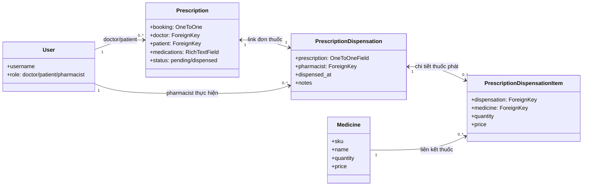

# Báo Cáo Miệng: Luồng Code Chức Năng Dược Sĩ (Pharmacy) trong PBL3

## A. Mục đích báo cáo
Nội dung này chuẩn bị cho phần trình bày miệng thuyết trình về phần code quản lý kho thuốc và cấp phát đơn thuốc của **Dược sĩ (Pharmacist)**.
Báo cáo sẽ chỉ rõ:
- Nhóm chức năng của Dược sĩ.
- Các file chứa logic, class và hàm tương ứng.
- Chi tiết luồng xử lý (Data Flow) và logic nghiệp vụ.
- Điểm nhấn kỹ thuật đặc biệt (Atomic Transaction & Pessimistic Locking chống tranh chấp dữ liệu).

---

## B. Tổng quan chức năng Dược sĩ
Phần Dược sĩ bao gồm 4 nhóm chức năng chính:
1. **Quản lý kho thuốc (Inventory Management)**: Xem danh sách, thêm mới, cập nhật thông tin thuốc và tìm kiếm thuốc trong kho.
2. **Quản lý đơn thuốc (Prescription Management)**: Theo dõi danh sách đơn thuốc từ Bác sĩ gửi sang (phân loại đơn chờ phát và đơn đã phát).
3. **Cấp phát thuốc (Dispensation)**: Dược sĩ chọn thuốc từ kho khớp với đơn thuốc của bác sĩ, kiểm tra số lượng tồn, thực hiện trừ kho và tạo phiếu phát thuốc kèm đơn giá lúc phát.
4. **Đổi mật khẩu bảo mật**: Dược sĩ tự thay đổi mật khẩu của mình.

---

## C. Các file quan trọng của phần Dược sĩ
- [pharmacy/models.py](file:///d:/PBL3.PY/PBL3/pharmacy/models.py): Khai báo cấu trúc bảng cơ sở dữ liệu (`Medicine`, `PrescriptionDispensation`, `PrescriptionDispensationItem`).
- [pharmacy/views.py](file:///d:/PBL3.PY/PBL3/pharmacy/views.py): Chứa toàn bộ các View xử lý logic nghiệp vụ và luồng điều hướng của dược sĩ.
- [pharmacy/forms.py](file:///d:/PBL3.PY/PBL3/pharmacy/forms.py): Form nhập liệu thông tin thuốc (`MedicineForm`) kèm validate trùng mã SKU.
- [pharmacy/urls.py](file:///d:/PBL3.PY/PBL3/pharmacy/urls.py): Định tuyến URL cho các chức năng của dược sĩ.
- [mixins/custom_mixins.py](file:///d:/PBL3.PY/PBL3/mixins/custom_mixins.py): Chứa `PharmacistRequiredMixin` phục vụ kiểm tra phân quyền dược sĩ.
- [accounts/management/commands/create_pharmacist.py](file:///d:/PBL3.PY/PBL3/accounts/management/commands/create_pharmacist.py): Command dòng lệnh để tạo nhanh tài khoản dược sĩ để chạy demo.

---

## D. Phân quyền và bảo mật tài khoản
### 1. Mixin phân quyền `PharmacistRequiredMixin`
File: [mixins/custom_mixins.py](file:///d:/PBL3.PY/PBL3/mixins/custom_mixins.py#L30-L40)

- Kế thừa từ `LoginRequiredMixin` của Django.
- Hàm `dispatch(self, request, *args, **kwargs)` sẽ chặn request nếu:
  1. User chưa đăng nhập.
  2. User có `role != "pharmacist"` (dựa trên trường `role` trong Custom User Model [accounts/models.py](file:///d:/PBL3.PY/PBL3/accounts/models.py)).
- Nếu vi phạm, hệ thống sẽ chuyển hướng hoặc trả lỗi `PermissionDenied`.

> [!TIP]
> **Điểm trình bày miệng**: "Toàn bộ các View trong module pharmacy đều kế thừa từ `PharmacistRequiredMixin`. Điều này đảm bảo tuyệt đối rằng chỉ tài khoản có vai trò Dược sĩ mới có quyền quản lý kho thuốc và thực hiện thao tác phát thuốc."

---

## E. Luồng quản lý kho thuốc (Inventory Management)
### 1. Cấu trúc dữ liệu thuốc
File: [pharmacy/models.py](file:///d:/PBL3.PY/PBL3/pharmacy/models.py#L5-L23)
Model `Medicine`:
- `sku` (Mã thuốc): Unique CharField.
- `name` (Tên thuốc): CharField.
- `quantity` (Số lượng tồn): PositiveIntegerField.
- `price` (Đơn giá): DecimalField.
- `unit` (Đơn vị tính): CharField (mặc định là "viên").
- `is_active`: BooleanField để vô hiệu hóa/kích hoạt thuốc trong kho.

### 2. Form thêm/sửa và Validate trùng lặp SKU
File: [pharmacy/forms.py](file:///d:/PBL3.PY/PBL3/pharmacy/forms.py#L5-L30)
Class `MedicineForm`:
- Kế thừa `forms.ModelForm`.
- Phương thức `clean_sku()`:
  - Khi thêm mới hoặc chỉnh sửa, hệ thống sẽ thực hiện truy vấn DB để kiểm tra xem mã SKU này đã tồn tại ở bản ghi khác chưa (`Medicine.objects.filter(sku=sku).exclude(pk=self.instance.pk).exists()`).
  - Nếu trùng, ném ra lỗi `ValidationError` ngăn không cho lưu.

### 3. Xem danh sách và tìm kiếm thuốc
File: [pharmacy/views.py](file:///d:/PBL3.PY/PBL3/pharmacy/views.py#L41-L60)
Class `MedicineListView`:
- Kế thừa `ListView`, phân trang `paginate_by = 10`.
- Phương thức `get_queryset()`:
  - Chỉ hiển thị các thuốc đang hoạt động (`is_active=True`).
  - Đọc tham số `q` từ request GET để tìm kiếm không phân biệt chữ hoa thường (`icontains`) theo cả `name` (Tên thuốc) và `sku` (Mã thuốc).

---

## F. Luồng quản lý và theo dõi đơn thuốc
### 1. Xem danh sách đơn thuốc từ bác sĩ
File: [pharmacy/views.py](file:///d:/PBL3.PY/PBL3/pharmacy/views.py#L84-L112)
Class `PrescriptionListView`:
- Đọc trạng thái đơn thuốc cần hiển thị từ tham số `status` trên URL GET (mặc định là `"pending"` - Chờ phát thuốc).
- Thực hiện tối ưu hóa truy vấn bằng `select_related("patient", "patient__profile", "doctor", "doctor__profile")` để tránh lỗi N+1 Query khi hiển thị tên bác sĩ kê đơn và bệnh nhân nhận thuốc.
- Hỗ trợ tìm kiếm đơn thuốc theo tên bệnh nhân hoặc tên bác sĩ.

---

## G. Luồng cấp phát thuốc (Dispensation) - Điểm nhấn kỹ thuật cốt lõi
Đây là chức năng quan trọng nhất của phân hệ Dược sĩ, đòi hỏi sự chính xác cao về số liệu tồn kho.

### 1. Cấu trúc dữ liệu Phiếu phát thuốc
File: [pharmacy/models.py](file:///d:/PBL3.PY/PBL3/pharmacy/models.py#L25-L76)
- `PrescriptionDispensation`: Phiếu phát thuốc. Liên kết **Một-Một (OneToOneField)** với đơn thuốc của bác sĩ `bookings.Prescription`. Lưu trữ dược sĩ trực tiếp cấp phát và thời gian phát.
- `PrescriptionDispensationItem`: Chi tiết các loại thuốc được phát. Lưu trữ liên kết tới `Medicine`, `quantity` (Số lượng phát), và `price` (đơn giá tại thời điểm phát - tránh trường hợp sau này giá thuốc thay đổi làm sai lệch lịch sử doanh thu).

### 2. Xử lý cấp phát thuốc (View & Transaction)
File: [pharmacy/views.py](file:///d:/PBL3.PY/PBL3/pharmacy/views.py#L114-L194)
Class `PrescriptionDispenseView`:

#### Luồng GET (Hiển thị trang chọn thuốc phát):
- Kiểm tra xem đơn thuốc đã được phát trước đó chưa (`prescription.status == "dispensed"`). Nếu rồi, chuyển hướng ngay về trang chi tiết phiếu phát thuốc.
- Lấy danh sách toàn bộ thuốc có trạng thái hoạt động và số lượng tồn lớn hơn 0 (`Medicine.objects.filter(is_active=True, quantity__gt=0)`) để đưa ra giao diện chọn.

#### Luồng POST (Xử lý trừ kho và lưu trữ):
1. Nhận danh sách mã thuốc `medicine_id[]` và số lượng phát tương ứng `quantity[]` từ giao diện.
2. Kiểm tra tính hợp lệ: phải chọn ít nhất một loại thuốc, số lượng phát phải lớn hơn 0.
3. Thực hiện bọc trong một **Database Transaction** (`with transaction.atomic()`):
   - Đảm bảo tính nhất quán dữ liệu (ACID). Nếu bất kỳ dòng thuốc nào bị lỗi (như hết hàng giữa chừng), toàn bộ quá trình cập nhật kho và tạo phiếu sẽ bị hủy bỏ (Rollback).
   - **Chống lỗi tranh chấp dữ liệu (Race Condition)**: Sử dụng phương thức `select_for_update()` của Django ORM để thực hiện khóa hàng dữ liệu thuốc trong Database (`Medicine.objects.select_for_update().get(pk=med_id)`).
   - Kiểm tra số lượng tồn hiện tại của thuốc trong DB: nếu nhỏ hơn số lượng yêu cầu phát, ném lỗi `ValueError` để kích hoạt Rollback.
   - Trừ trực tiếp số lượng tồn trong kho: `medicine.quantity -= qty` và gọi `medicine.save()`.
   - Tạo bản ghi chi tiết thuốc phát `PrescriptionDispensationItem`.
4. Đổi trạng thái đơn thuốc bác sĩ kê thành `"dispensed"` (Đã phát thuốc) để kết thúc quy trình khám chữa bệnh & cấp phát.

> [!IMPORTANT]
> **Điểm thuyết trình ghi điểm**:
> - "Tôi đã áp dụng `transaction.atomic()` khi trừ kho thuốc để đảm bảo tính nhất quán dữ liệu. Nếu hệ thống lỗi giữa chừng khi đang trừ dở 5 loại thuốc trong đơn, database sẽ rollback toàn bộ về trạng thái cũ, không sợ bị lệch kho."
> - "Để giải quyết bài toán hai dược sĩ cùng thao tác cấp phát một loại thuốc cùng một thời điểm dẫn đến số lượng tồn kho âm hoặc sai lệch (Race Condition), tôi sử dụng **Pessimistic Locking (Khóa bi quan)** qua câu lệnh `select_for_update()`. Dòng thuốc đang thao tác sẽ bị khóa cho đến khi transaction hoàn thành."

---

## H. Liên kết dữ liệu giữa các phân hệ (Relationships)

- Bác sĩ kê đơn thuốc (`bookings.Prescription`), lưu trữ thông tin triệu chứng, chuẩn đoán và danh sách thuốc tự ghi bằng CKEditor. Trạng thái mặc định là `"pending"`.
- Dược sĩ nhìn thấy đơn thuốc trên dashboard, mở giao diện cấp phát thuốc.
- Dược sĩ lấy thuốc từ bảng `Medicine` trong module `pharmacy` để thực hiện trừ kho và tạo hóa đơn phát thuốc.

---

## I. Hướng dẫn trình bày bằng miệng (Tips thuyết trình)
1. **Mở đầu**: *"Em xin trình bày về module Dược sĩ (Pharmacy) trong hệ thống PBL3 của nhóm. Chức năng chính của phần này là quản lý kho dược phẩm của phòng khám và quy trình cấp phát thuốc theo đơn từ bác sĩ sang."*
2. **Khoe luồng nghiệp vụ**: *"Dược sĩ có một Dashboard riêng hiển thị thống kê tổng số thuốc hoạt động, số đơn chờ phát, và số đơn đã phát trong ngày để nắm bắt công việc. Dược sĩ có thể dễ dàng quản lý kho thuốc, tìm kiếm thuốc theo tên/mã SKU."*
3. **Phân tích kỹ thuật (Phần quan trọng nhất)**: *"Điểm kỹ thuật quan trọng nhất ở đây nằm ở view phát thuốc `PrescriptionDispenseView`. Khi Dược sĩ nhấn phát thuốc, hệ thống sẽ kích hoạt một transaction atomic. Để ngăn ngừa Race Condition khi có nhiều dược sĩ cùng phát thuốc cùng lúc, em đã sử dụng cơ chế Pessimistic Locking với phương thức `select_for_update()` của Django để khóa dữ liệu thuốc trong kho cho đến khi trừ kho thành công và ghi nhận phiếu phát thuốc."*
4. **Kết luận**: *"Quy trình khép kín từ lúc Bác sĩ kê đơn, chuyển trạng thái chờ phát thuốc, Dược sĩ kiểm tra kho, trừ kho và phát thuốc giúp phòng khám vận hành trơn tru và dữ liệu kho thuốc luôn chính xác."*
