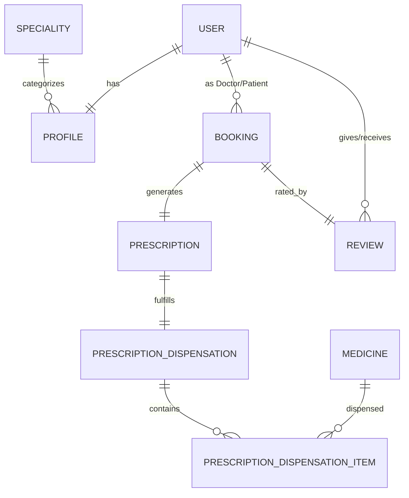

# Báo Cáo Miệng: Cấu Trúc Hệ Thống & Kiến Trúc Phần Mềm PBL3

## A. Mục đích báo cáo
Tài liệu này chuẩn bị cho phần trình bày miệng thuyết trình về **Cấu trúc hệ thống (System Architecture)**, thiết kế cơ sở dữ liệu, phân hệ chức năng và các file cấu hình cốt lõi (`settings.py`, `urls.py`, `core`...).
Báo cáo sẽ giúp thầy cô thấy được sự mạch lạc, tính mở rộng (scalability), khả năng phân quyền và tổ chức mã nguồn khoa học của dự án.

---

## B. Mô hình kiến trúc tổng quan
Dự án được xây dựng dựa trên **Django Framework (Python)**, sử dụng mô hình kiến trúc **MVT (Model-View-Template)**:
- **Model (M)**: Quản lý tầng dữ liệu, tương tác với Database thông qua Django ORM.
- **View (V)**: Xử lý logic nghiệp vụ, tiếp nhận request từ người dùng, truy vấn Model và chuẩn bị context để trả về giao diện.
- **Template (T)**: Tầng giao diện người dùng (HTML/CSS/JS), sử dụng công cụ Render Template của Django để hiển thị dữ liệu động.

> **Hệ quản trị cơ sở dữ liệu**:
> - Môi trường Phát triển (Development): Sử dụng **SQLite** (`db.sqlite3`) gọn nhẹ, không cần cài đặt phức tạp.
> - Môi trường Triển khai (Production): Sẵn sàng kết nối với các DBMS mạnh mẽ hơn (như PostgreSQL, MySQL) nhờ lớp trừu tượng Django ORM mà không cần sửa đổi code logic.

---

## C. Cấu trúc thư mục dự án
Hệ thống được thiết kế theo hướng **Component-based** (chia thành nhiều Django App độc lập, dễ bảo trì và mở rộng):

```
PBL3/
│
├── doccure/                    # Thư mục cấu hình trung tâm (Project Config)
│   ├── settings.py             # Khai báo cấu hình, app cài đặt, middleware, DB...
│   ├── urls.py                 # Định tuyến URL tổng cho toàn hệ thống
│   ├── wsgi.py / asgi.py       # Cấu hình cổng kết nối chạy server (Web Server Gateway Interface)
│
├── core/                       # App chứa thành phần dùng chung (Shared Components)
│   ├── models.py               # Chuyên khoa (Speciality), Đánh giá (Review)
│   ├── decorators.py           # Bộ trang trí kiểm tra role bác sĩ, dược sĩ cho view dạng hàm
│   └── views.py                # View trang chủ (home) và các trang tĩnh (Privacy, Terms)
│
├── accounts/                   # App quản lý tài khoản & phân quyền (Auth & Users)
│   ├── models.py               # Custom User (User) với các Role và Profile mở rộng
│   └── views.py / forms.py     # Đăng ký, đăng nhập, quên mật khẩu
│
├── doctors/                    # App nghiệp vụ Bác sĩ
│   ├── models/                 # Lịch làm việc theo ngày, Học vấn, Kinh nghiệm
│   └── views.py / forms.py     # Cập nhật profile, quản lý lịch khám, kê đơn thuốc
│
├── patients/                   # App nghiệp vụ Bệnh nhân
│   └── views.py / forms.py     # Tìm kiếm bác sĩ, đặt lịch hẹn, xem lịch sử bệnh án
│
├── bookings/                   # App xử lý nghiệp vụ đặt khám & Đơn thuốc
│   ├── models.py               # Cuộc hẹn (Booking), Đơn thuốc (Prescription)
│   └── views.py                # Xử lý sinh slot khám trống động và lưu trữ booking
│
├── pharmacy/                   # App quản lý Kho thuốc & Phát thuốc (Dược sĩ)
│   ├── models.py               # Thuốc (Medicine), Phiếu phát thuốc, Chi tiết phiếu phát
│   └── views.py / forms.py     # Quản lý kho, trừ kho thuốc, xác nhận phát thuốc
│
├── mixins/                     # Các lớp bảo vệ quyền truy cập (Custom Mixins)
│   └── custom_mixins.py        # Kiểm tra Role Bác sĩ/Bệnh nhân/Dược sĩ cho Class-based views
│
├── templates/                  # Thư mục chứa giao diện HTML toàn cục
├── static/                     # Assets tĩnh dùng chung (CSS, JS, Images)
├── media/                      # Lưu trữ tệp tin do người dùng tải lên (Avatar, ảnh chuyên khoa...)
├── db.sqlite3                  # File cơ sở dữ liệu SQLite
└── manage.py                   # Script quản lý dự án qua dòng lệnh của Django
```

---

## D. Phân tích các file cấu hình cốt lõi

### 1. File cấu hình dự án `settings.py`
File: [doccure/settings.py](file:///d:/PBL3.PY/PBL3/doccure/settings.py)
Các thiết lập quan trọng cần nhấn mạnh khi bảo cáo:
- **Khai báo Apps (`INSTALLED_APPS`)**: 
  - Đăng ký đầy đủ các App tự viết (`core`, `accounts`, `doctors`, `patients`, `bookings`, `pharmacy`).
  - Sử dụng thư viện ngoài: `debug_toolbar` (đo hiệu năng truy vấn), `ckeditor` (trình soạn thảo đơn thuốc phong phú cho bác sĩ).
- **Custom User Model (`AUTH_USER_MODEL = "accounts.User"`)**:
  - Django mặc định sử dụng Model User đơn giản. Trong dự án này, chúng ta đã ghi đè bằng Model User của riêng mình để thêm cột `role` (doctor/patient/pharmacist) và `registration_number` (mã số đăng ký hành nghề bác sĩ).
- **Middleware**:
  - `LocaleMiddleware`: Hỗ trợ đa ngôn ngữ (Tiếng Việt và Tiếng Anh).
  - `SecurityMiddleware`, `SessionMiddleware`, `CsrfViewMiddleware` (Chống tấn công giả mạo request).
- **Ngôn ngữ và Múi giờ**:
  - `LANGUAGE_CODE = "vi"` (Mặc định hiển thị Tiếng Việt).
  - Cấu hình static/media và ckeditor phục vụ tải file.

### 2. File định tuyến trung tâm `urls.py`
File: [doccure/urls.py](file:///d:/PBL3.PY/PBL3/doccure/urls.py)
- Sử dụng phương thức `include` để liên kết tới các file định tuyến `urls.py` con của từng app riêng biệt. 
- Giúp giảm thiểu xung đột code khi làm việc nhóm và giữ cho file định tuyến trung tâm gọn gàng:
  ```python
  urlpatterns = [
      path('admin/', admin.site.urls),
      path('', include('core.urls')),
      path('accounts/', include('accounts.urls')),
      path('doctors/', include('doctors.urls')),
      path('patients/', include('patients.urls')),
      path('bookings/', include('bookings.urls')),
      path('pharmacy/', include('pharmacy.urls')),
  ]
  ```

---

## E. Thiết kế cơ sở dữ liệu và mối liên hệ các Module
Sự chặt chẽ của cơ sở dữ liệu thể hiện ở việc các bảng kết nối logic với nhau qua khóa ngoại (`ForeignKey`) và khóa một-một (`OneToOneField`).



### Chi tiết các mối quan hệ:
1. ** accounts & core**:
   - `User` liên kết 1-1 với `Profile` để lưu trữ các thông tin chi tiết (ngày sinh, giới tính, địa chỉ, chuyên khoa...).
   - `Profile` của Bác sĩ chứa trường `specialization` liên kết tới bảng `Speciality` (Chuyên khoa) nằm trong App `core`.
2. ** bookings & accounts**:
   - Model `Booking` (Lịch khám) giữ hai khóa ngoại tới `User`: `doctor` (role = doctor) và `patient` (role = patient).
   - Thiết lập `unique_together = ["doctor", "appointment_date", "appointment_time"]` để chặn tuyệt đối việc trùng lịch khám của cùng một bác sĩ tại cùng một khung giờ.
3. ** bookings & core**:
   - Mỗi cuộc hẹn (`Booking`) sau khi hoàn thành có thể được Bệnh nhân đánh giá thông qua Model `Review` (Đánh giá) nằm trong App `core`.
4. ** pharmacy & bookings**:
   - Khi bác sĩ khám xong, họ đổi trạng thái Booking thành "Completed" và kê một Đơn thuốc (`Prescription`).
   - Đơn thuốc có quan hệ 1-1 với `Booking`.
   - Dược sĩ dựa trên đơn thuốc này để phát thuốc, tạo ra phiếu `PrescriptionDispensation` (quan hệ 1-1 với `Prescription`).

---

## F. Cơ chế Phân Quyền Hệ Thống (Security & Authorization)
Hệ thống sử dụng hai cơ chế kiểm soát truy cập tùy thuộc vào loại View:

### 1. Dành cho Class-based Views (Sử dụng Mixin)
File: [mixins/custom_mixins.py](file:///d:/PBL3.PY/PBL3/mixins/custom_mixins.py)
- **`DoctorRequiredMixin`**: Kiểm tra user đăng nhập và phải có `role == "doctor"`.
- **`PatientRequiredMixin`**: Kiểm tra user đăng nhập và phải có `role == "patient"`.
- **`PharmacistRequiredMixin`**: Kiểm tra user đăng nhập và phải có `role == "pharmacist"`.

### 2. Dành cho Function-based Views (Sử dụng Decorator)
File: [core/decorators.py](file:///d:/PBL3.PY/PBL3/core/decorators.py)
- Các decorator `@user_is_doctor` và `@user_is_pharmacist` bọc ngoài các hàm xử lý request để ném ra lỗi `PermissionDenied` (HTTP 403) nếu tài khoản truy cập trái phép.

---

## G. Luồng đi của một Request trong hệ thống (Request Life-Cycle)
Để thuyết trình mạch lạc, hãy mô tả luồng đi khi Bệnh nhân truy cập trang web:
1. **Trình duyệt gửi HTTP GET Request** đến `/doctors/profile-settings/`.
2. **Django Web Server** tiếp nhận, chạy qua các **Middleware** (kiểm tra bảo mật, định dạng ngôn ngữ).
3. **Bộ định tuyến URL** tìm kiếm trong [doccure/urls.py](file:///d:/PBL3.PY/PBL3/doccure/urls.py), chuyển tiếp tới `doctors/urls.py`, ánh xạ tới View `DoctorProfileUpdateView`.
4. **View** chạy lớp bảo vệ `DoctorRequiredMixin`.
   - Nếu chưa đăng nhập hoặc không phải Doctor -> chặn lại, chuyển hướng sang trang Login.
   - Nếu hợp lệ -> Gọi Model lấy dữ liệu từ cơ sở dữ liệu (`db.sqlite3`).
5. **View** tổ chức dữ liệu, đưa vào **Template** `doctors/profile-settings.html`.
6. **Template Engine** biên dịch mã HTML động và trả về HTTP Response cho trình duyệt hiển thị giao diện đẹp mắt cho người dùng.

---

## H. Cách thuyết trình miệng đạt điểm cao
1. **Nhấn mạnh tính tổ chức**: *"Hệ thống của tụi em được tổ chức chặt chẽ theo từng App độc lập (accounts, doctors, patients, bookings, pharmacy, core). Cách thiết kế này giúp code có tính độc lập cao (Low Coupling), dễ dàng phân chia công việc cho các thành viên trong nhóm và cực kỳ thuận tiện khi cần mở rộng thêm chức năng sau này."*
2. **Khoe Custom User Model**: *"Để quản lý phân vai một cách tối ưu, thay vì dùng User mặc định của Django, tụi em đã ghi đè bằng Custom User Model (`accounts.User`). Điều này giúp phân biệt rõ các vai trò Doctor, Patient, Pharmacist ngay từ tầng cơ sở dữ liệu và dễ dàng kiểm soát quyền truy cập."*
3. **Phân quyền chặt chẽ**: *"Tất cả các chức năng nhạy cảm đều được bảo vệ nghiêm ngặt bằng cả Mixin (cho Class-based view) và Decorator tự viết (cho Function view). Người dùng không thể hack URL để truy cập trái phép vào trang của vai trò khác."*
